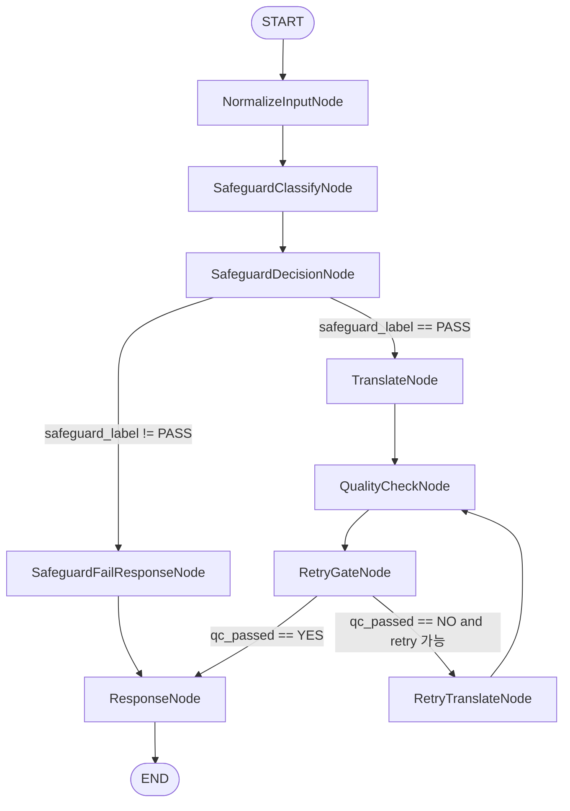

# 01. LangGraph 구성 요소: State, Node, Graph

## 이 챕터에서 다루는 내용

- LangGraph에서 **상태(State)**가 무엇인지
- **노드(Node)**가 하는 일과 입력/출력 규칙
- **그래프(Graph)**가 실행 흐름을 만드는 방식
- 초보자가 바로 이해할 수 있는 최소 예제

---

## 1. State: 노드들이 공유하는 데이터 박스

LangGraph의 핵심은 **상태(State)**입니다.
상태는 노드들이 주고받는 **공유 데이터 구조**이고, 그래프는 이 상태를 계속 갱신합니다.

- 상태는 **최소한의 필드**로 설계한다.
- 상태는 **사실 데이터**만 담고, 가공 결과는 새 키로 기록한다.
- 상태는 노드 간 인터페이스(Interface)이다.

### 상태 예시

```python
from typing import TypedDict


class ReviewState(TypedDict):
    """리뷰 처리 흐름에서 공유되는 상태."""

    raw_text: str
    cleaned_text: str
    label: str
```

이 예시는 **입력(raw_text)** → **정제(cleaned_text)** → **라벨(label)** 흐름을 전제로 합니다.

### 커스텀 상태와 리듀서(Reducer)

실전에서는 **여러 노드가 같은 키를 업데이트**하는 경우가 있습니다.
이때는 **리듀서(Reducer)**로 병합 규칙을 명시하면 안전합니다.

- 리듀서는 **기존 값과 새 값**을 받아 **병합 결과**를 반환한다.
- 대표적인 예는 **로그 누적**, **메시지 히스토리 합치기**다.
- 리듀서를 쓰면 노드가 **부분 업데이트**만 반환해도 상태가 일관되게 합쳐진다.

#### 리듀서 예시 (리스트 누적)

```python
from typing import Annotated, TypedDict
import operator


class ReviewState(TypedDict):
    """리뷰 처리 흐름에서 공유되는 상태."""

    raw_text: str
    logs: Annotated[list[str], operator.add]
```

이 설정에서는 노드가 `{"logs": ["정제 완료"]}` 같은 **부분 업데이트**를 반환하면
기존 `logs`와 **자동으로 합쳐집니다**.

#### 커스텀 리듀서 예시 (최신 값 우선)

```python
from typing import Annotated, TypedDict


def keep_latest(old: str, new: str) -> str:
    """항상 최신 값을 유지하는 리듀서."""
    return new if new else old


class ReviewState(TypedDict):
    """리뷰 처리 흐름에서 공유되는 상태."""

    raw_text: str
    latest_label: Annotated[str, keep_latest]
```

리듀서는 **상태 키의 합의 규칙**이므로, 팀 내부에서 문서화해 두는 것이 좋습니다.

---

## 2. Node: 상태를 읽고, 상태를 갱신하는 함수

노드는 **상태를 입력받아 상태를 갱신하는 함수**입니다.
즉, 노드의 역할은 하나의 작은 작업을 수행하고, 결과를 상태에 기록하는 것입니다.

- 노드는 **한 가지 책임만** 가진다.
- 입력 상태를 직접 수정하지 않고, **새 상태를 반환**한다.
- 실패 가능성이 있는 경우, **오류 정보를 상태에 명시적으로 기록**한다.

### 노드의 최소 구조

```python
def clean_text(state: ReviewState) -> ReviewState:
    cleaned = state["raw_text"].strip()
    return {**state, "cleaned_text": cleaned}
```

### 구현 방향: 함수형 vs 클래스형 노드

노드는 **함수로 직접 정의**하거나, **클래스의 `run()` 메서드**로 정의할 수 있습니다.

- **함수형 노드**: `graph.add_node("clean", clean_text)`처럼 순수 함수로 등록한다.
- **클래스형 노드**: `graph.add_node("clean", node.run)`처럼 인스턴스의 메서드를 등록한다.

구현 선택 시 주의할 점:

- **상태 공유는 항상 `state`로** 한다. 노드 간 데이터는 입력/출력 상태를 통해 전달된다.
- 클래스형 노드는 **무상태(stateless)** 로 설계하는 것이 안전하다.
  - 인스턴스 멤버에 값을 저장하면 **그래프 실행 간에 공유**될 수 있다.
  - 필요한 값은 모두 `state`에 기록하고 반환하는 방식이 권장된다.

### 전체 업데이트 vs. 부분 업데이트

노드는 보통 두 가지 방식으로 상태를 갱신합니다.

1. **전체 업데이트**: 상태 전체를 다시 만들어 반환한다.
2. **부분 업데이트**: 변경된 키만 반환한다(리듀서와 함께 쓰면 안전하다).

#### 전체 업데이트 예시

```python
def clean_text(state: ReviewState) -> ReviewState:
    cleaned = state["raw_text"].strip()
    return {**state, "cleaned_text": cleaned}
```

#### 부분 업데이트 예시 (리듀서 기반)

```python
def add_log(state: ReviewState) -> dict[str, list[str]]:
    return {"logs": ["clean: 정제 완료"]}
```

부분 업데이트는 **리듀서가 정의된 키**에서 특히 유용합니다.
리듀서가 없다면 전체 업데이트 방식이 더 안전합니다.

---

## 3. Graph: 노드들을 연결해 실행 흐름을 만든다

그래프는 노드들을 **엣지(Edge)**로 연결해 실행 순서를 정의합니다.

- `add_node`: 노드를 등록한다.
- `add_edge`: 노드 간 연결을 만든다.
- `set_entry_point`: 시작 노드를 지정한다.
- `END`: 실행 종료 지점을 의미한다.

즉, **그래프는 실행 순서의 설계도**입니다.

---

## 3-1. Graph 동작 이론: 상태가 어떻게 공유되고 진행되는가

그래프는 하나의 실행(run) 동안 **상태(State)가 흐르는 통로**로 이해하면 쉽습니다. 실행이 시작되면 초기 상태가 그래프의 시작 노드로 전달됩니다. 각 노드는 상태를 입력으로 받아 작은 작업을 수행합니다. 그 결과를 상태에 반영해 다음 노드로 넘깁니다. 이 과정이 노드 수만큼 반복되며, 상태는 점진적으로 풍부해집니다.

상태 공유의 핵심은 **노드 간 데이터는 항상 상태로만 전달**된다는 점입니다. 노드 내부의 지역 변수는 다음 노드로 전달되지 않습니다. 반면 상태에 기록된 값은 다음 노드가 그대로 읽을 수 있습니다. 따라서 설계 시에는 “어떤 정보가 다음 단계에 꼭 필요한가”를 먼저 정의해야 합니다. 이 규칙이 명확할수록 그래프의 예측 가능성이 높아집니다.

노드는 상태를 **전체 업데이트**하거나 **부분 업데이트**할 수 있습니다. 전체 업데이트는 상태 전체를 새로 구성해 반환하는 방식입니다. 부분 업데이트는 변경된 키만 반환하는 방식이며, 리듀서가 있다면 안전하게 병합됩니다. 리듀서가 없는 경우에는 충돌이 생길 수 있으므로 전체 업데이트가 더 안전합니다. 즉, 상태 병합 규칙이 그래프의 안정성을 좌우합니다.

그래프의 흐름은 **엣지와 조건부 분기**로 결정됩니다. 일반 엣지는 항상 다음 노드를 정해진 순서대로 실행합니다. 조건부 엣지는 상태 값에 따라 서로 다른 노드로 분기합니다. 이때 분기 기준이 되는 값은 이전 노드가 상태에 기록한 결과입니다. 결국 “상태가 다음 경로를 결정한다”는 점이 핵심 개념입니다.

한 번의 실행 동안 상태는 **공유되지만, 실행 간에는 공유되지 않습니다**. 즉, 동일한 그래프라도 각 실행은 독립적인 상태를 사용합니다. 이 분리는 동시 요청에서도 기본적으로 유지되어 안전합니다. 다만 노드 인스턴스가 내부 상태를 가진다면, 인스턴스가 공유될 때 실행 간 간섭이 발생할 수 있습니다. 그래서 노드는 무상태로 설계하는 것이 가장 안전합니다.

그래프는 **시작점과 종료점이 명확해야** 예측 가능한 동작을 보장합니다. 시작점은 초기 상태가 들어가는 첫 노드이고, 종료점은 최종 결과가 반환되는 시점입니다. 시작점이 모호하면 어떤 노드가 먼저 실행되는지 혼란이 생깁니다. 종료점이 모호하면 상태가 완결되지 않은 채 반환될 수 있습니다. 따라서 엔트리 포인트와 END는 설계의 필수 요소입니다.

실무에서는 상태에 **오류나 경고 정보를 함께 기록**하는 패턴이 매우 유용합니다. 예외가 발생한 노드는 오류 정보를 상태에 넣고 다음 노드가 이를 해석하게 할 수 있습니다. 이 방식은 흐름을 중단하지 않고도 문제 상황을 명확히 전달합니다. 또한 API 응답이나 로그 노드에서 오류 메시지를 일관되게 구성할 수 있습니다. 결과적으로 그래프 전체의 복원력이 높아집니다.

정리하면, 그래프는 **상태를 중심으로 작은 노드들이 연결된 파이프라인**입니다. 상태는 실행 흐름을 전달하는 버스 역할을 하며, 노드는 버스에 정보를 올리고 내리는 역할을 합니다. 분기와 재시도도 결국 상태 값으로 제어됩니다. 이 구조를 이해하면 복잡한 그래프도 작은 블록으로 나눠 설계할 수 있습니다. 그래서 초보자일수록 상태 설계부터 시작하는 것이 가장 효과적입니다.

---

## 4. 가장 작은 예제 (State → Node → Graph)

아래 코드는 상태를 정의하고, 두 개의 노드를 연결한 **가장 단순한 파이프라인**입니다.
실제 LLM 호출은 `label` 노드 내부에 들어간다고 가정합니다.

```python
"""
목적: 상태/노드/그래프 관계를 가장 단순한 형태로 보여준다.
설명: 상태를 정의하고, 두 개의 노드를 연결해 파이프라인을 구성한다.
디자인 패턴: Pipeline
"""

from dataclasses import dataclass
from typing import TypedDict
from langgraph.graph import StateGraph, END


class ReviewState(TypedDict):
    """리뷰 처리 흐름에서 공유되는 상태."""

    raw_text: str
    cleaned_text: str
    label: str


@dataclass(frozen=True)
class ReviewPipelineBuilder:
    """리뷰 정제 → 라벨링 파이프라인 그래프를 생성하는 빌더."""

    def build(self) -> StateGraph:
        """파이프라인 그래프를 생성한다.

        Returns:
            StateGraph: 실행 가능한 그래프 객체.
        """
        graph = StateGraph(ReviewState)
        graph.add_node("clean", self._clean)
        graph.add_node("label", self._label)
        graph.add_edge("clean", "label")
        graph.add_edge("label", END)
        graph.set_entry_point("clean")
        return graph

    def _clean(self, state: ReviewState) -> ReviewState:
        """리뷰 텍스트를 정리한다."""
        cleaned = state["raw_text"].strip()
        return {**state, "cleaned_text": cleaned}

    def _label(self, state: ReviewState) -> ReviewState:
        """리뷰 라벨을 상태에 기록한다.

        실제 프로젝트에서는 이 위치에 LLM 호출이 들어간다.
        """
        label = "불만" if "불만" in state["cleaned_text"] else "일반"
        return {**state, "label": label}
```

### 사용 예 (개념)

```python
builder = ReviewPipelineBuilder()
graph = builder.build().compile()
result = graph.invoke({"raw_text": "불만이 있어서 문의드립니다."})
```

---

## 4-1. 도식용 텍스트: 상태 흐름과 분기

아래는 그래프 흐름을 **문자 기반 도식**으로 표현한 예시입니다.
문서를 슬라이드나 화이트보드로 옮길 때 그대로 복사해 사용할 수 있습니다.
각 줄의 화살표는 “상태가 다음 노드로 전달됨”을 의미합니다.
대괄호는 상태 값에 따른 조건 분기를 나타냅니다.
필요에 따라 노드 이름과 상태 키를 바꿔 사용하면 됩니다.

```
START
  ↓ (초기 상태 주입)
NormalizeInput
  ↓ (normalized_text 기록)
SafeguardClassify
  ↓ (safeguard_label 기록)
SafeguardDecision
  ├─ [safeguard_label != "PASS"] → SafeguardFailResponse → Response → END
  └─ [safeguard_label == "PASS"] → Translate → QualityCheck
                                         ↓ (qc_passed 기록)
                                      RetryGate
                                        ├─ [qc_passed == "YES"] → Response → END
                                        └─ [qc_passed == "NO" and retry 가능] → RetryTranslate → QualityCheck (loop)
```

도식은 **상태 키가 경로를 결정한다**는 핵심을 강조합니다.
각 노드는 “상태에 무엇을 기록하는가”로 설명할 수 있습니다.
분기 기준이 되는 키는 반드시 상태 스키마에 포함되어야 합니다.
루프가 있는 경우에는 종료 조건을 명확히 표기하는 것이 중요합니다.
이 텍스트는 교육 자료용으로 그대로 재사용할 수 있습니다.

---

## 4-2. 도식 텍스트(프로젝트 기준): 번역 그래프 흐름

아래는 이 프로젝트의 번역 그래프 기준으로 **노드 이름을 맞춘 도식**입니다.
그래프에서 실제로 쓰는 노드 클래스명과 상태 키를 함께 보이도록 구성했습니다.
이 도식은 `TranslateGraph`를 구현할 때의 기준선으로 사용됩니다.
각 화살표는 상태가 다음 노드로 전달되는 경로를 의미합니다.
조건 분기는 상태 값이 어떤지에 따라 다음 노드가 달라짐을 나타냅니다.

```
START
  ↓ (초기 상태 주입)
NormalizeInputNode
  ↓ (normalized_text 기록)
SafeguardClassifyNode
  ↓ (safeguard_label 기록)
SafeguardDecisionNode
  ├─ [safeguard_label != "PASS"] → SafeguardFailResponseNode → ResponseNode → END
  └─ [safeguard_label == "PASS"] → TranslateNode → QualityCheckNode
                                         ↓ (qc_passed 기록)
                                      RetryGateNode
                                        ├─ [qc_passed == "YES"] → ResponseNode → END
                                        └─ [qc_passed == "NO" and retry 가능] → RetryTranslateNode → QualityCheckNode (loop)
```

이 버전은 **노드 구현 순서**를 그대로 따라가도록 설계했습니다.
특히 `RetryGateNode`는 상태 값(`qc_passed`, `retry_count`)을 기준으로 분기합니다.
실제 구현 시에는 이 도식의 경로가 코드의 엣지 정의와 일치해야 합니다.
만약 경로가 다르다면, 상태 키와 분기 규칙부터 다시 점검해야 합니다.
그래프가 커질수록 이 도식은 설계 회의의 공통 언어가 됩니다.

---

## 4-3. 다이어그램 텍스트: Mermaid 버전

아래는 위 흐름을 **Mermaid 다이어그램**으로 표현한 버전입니다.
문서나 위키에서 Mermaid를 지원한다면 그대로 붙여넣어 사용할 수 있습니다.
조건 분기는 상태 값에 따라 다른 경로로 나뉘는 것을 보여줍니다.
루프는 `RetryTranslateNode → QualityCheckNode`로 되돌아가는 경로로 표시됩니다.
필요에 따라 노드 라벨이나 상태 키를 조정해 사용하세요.



Mermaid를 사용할 때는 **노드 이름이 너무 길면 줄바꿈이 깨질 수** 있습니다.
그런 경우 라벨만 짧게 바꾸고, 본문에서 풀네임을 매핑해 주면 됩니다.
또한 조건 라벨은 길이를 줄여도 의미가 명확하도록 유지하는 것이 좋습니다.
다이어그램은 설계 공유용이며, 코드는 항상 상태 키 기준으로 유지되어야 합니다.
그래프 변경 시에는 반드시 이 다이어그램도 함께 갱신하세요.

---

## 5. 초보자를 위한 설계 팁

- 상태 키는 **작고 명확한 이름**을 사용한다.
- 노드 출력은 **항상 상태 스키마를 만족**하도록 한다.
- 그래프는 먼저 **직선형 파이프라인**으로 시작하고, 익숙해지면 분기를 추가한다.

---

## 6. 구현 체크리스트

- 상태(State) 스키마가 문서화되어 있는가?
- 노드(Node)가 한 가지 책임만 수행하는가?
- 그래프(Graph)의 시작점과 종료점이 명확한가?
- 각 노드의 입력/출력 인터페이스가 일관적인가?

---

## 7. Wrap-up: 상태/노드/그래프 + 리듀서를 한 번에 보기

아래 코드는 **상태 정의 + 리듀서 + 노드 + 그래프**를 하나로 묶은 예시입니다.
노드가 `logs`를 부분 업데이트하면, 리듀서가 자동으로 누적해 줍니다.

```python
"""
목적: 상태/노드/그래프/리듀서를 하나의 예제로 정리한다.
설명: 부분 업데이트와 리듀서 병합 규칙을 함께 보여준다.
디자인 패턴: Pipeline
"""

from dataclasses import dataclass
from typing import Annotated, TypedDict
import operator
from langgraph.graph import StateGraph, END


def keep_latest(old: str, new: str) -> str:
    """항상 최신 값을 유지하는 리듀서."""
    return new if new else old


class ReviewState(TypedDict):
    """리뷰 처리 흐름에서 공유되는 상태."""

    raw_text: str
    cleaned_text: str
    latest_label: Annotated[str, keep_latest]
    logs: Annotated[list[str], operator.add]


@dataclass(frozen=True)
class ReviewPipelineBuilder:
    """리뷰 정제 → 라벨링 파이프라인 그래프를 생성하는 빌더."""

    def build(self) -> StateGraph:
        """리듀서를 포함한 파이프라인 그래프를 생성한다."""
        graph = StateGraph(ReviewState)
        graph.add_node("clean", self._clean)
        graph.add_node("label", self._label)
        graph.add_edge("clean", "label")
        graph.add_edge("label", END)
        graph.set_entry_point("clean")
        return graph

    def _clean(self, state: ReviewState) -> ReviewState:
        """리뷰 텍스트를 정리하고 로그를 남긴다."""
        cleaned = state["raw_text"].strip()
        return {
            **state,
            "cleaned_text": cleaned,
            "logs": ["clean: 정제 완료"],
        }

    def _label(self, state: ReviewState) -> ReviewState:
        """라벨을 결정하고 로그를 남긴다."""
        label = "불만" if "불만" in state["cleaned_text"] else "일반"
        return {
            **state,
            "latest_label": label,
            "logs": [f"label: {label}"],
        }
```

### 사용 예 (개념)

```python
builder = ReviewPipelineBuilder()
graph = builder.build().compile()
result = graph.invoke({"raw_text": "불만이 있어서 문의드립니다.", "logs": []})
```
