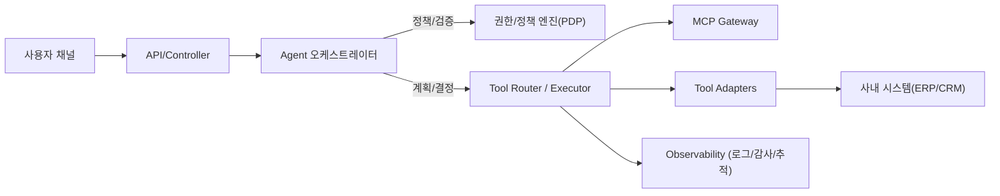
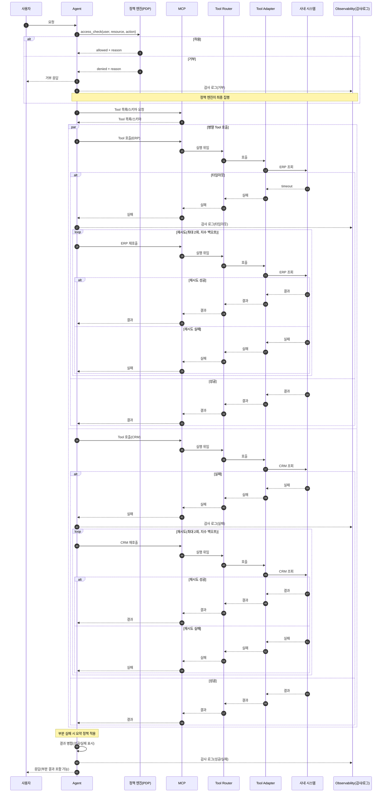

# 01. Agent, Tool, MCP 개요

## 이 챕터에서 배우는 것

- Agent/Tool/MCP를 **역할과 책임** 기준으로 분해하는 방법
- 사내 시스템 통합에서 **표준화**가 필요한 이유
- 제어와 실행을 분리하는 **아키텍처적 이점**
- SI 관점의 **사내 시스템 통합 시나리오**와 업무 흐름
- **권한 조회 vs 권한 집행**을 분리하는 보안 설계 기준

이 문서는 **초보자부터 고급자까지** 이어지는 튜토리얼입니다.  
처음에는 용어와 역할을 잡고, 이후 통합/보안/운영 관점까지 확장합니다.  
각 섹션은 “왜 필요한지 → 어떻게 설계하는지” 순서로 읽어보세요.

---

## 1. Agent / Tool / MCP를 함께 봐야 하는 이유

이 섹션은 “왜 굳이 세 개를 같이 봐야 하는지”를 이해하는 단계입니다.
초급자는 역할 분리를 통해 혼란을 줄이는 이유를, 중급 이상은 통합 비용과 운영 리스크의 관점에서 읽으면 됩니다.
핵심은 **결정(Agent)과 실행(Tool)을 분리하고, 표준화(MCP)로 통합 비용을 낮추는 것**입니다.


실무에서 LLM을 쓰는 서비스는 보통 **결정(Agent)** 과 **실행(Tool)** 을 분리합니다. 그리고 여러 Tool을 표준 방식으로 제공하는 레이어가 **MCP** 입니다.

- Agent는 **무엇을 할지 결정**한다.
- Tool은 **실제 행동을 수행**한다.
- MCP는 **여러 Tool을 안전하고 일관되게 제공**한다.

여기서 핵심은 **통합 비용**입니다. 모델 종류가 늘고, Tool이 늘면 통합은 `N x M` 문제가 됩니다. MCP 같은 표준을 두면 **N + M** 구조로 줄어듭니다.

또한 운영 관점에서 보면,

- Agent는 정책/판단(제어 평면)
- Tool은 실제 작업(데이터/행동 평면)

으로 나누는 것이 안정적입니다. 이 분리는 장애 대응, 보안 통제, 테스트 전략을 단순하게 만듭니다.

---

## 2. 핵심 정의

이 섹션은 용어를 정리하는 “기본 사전”입니다.
정의가 흔들리면 설계와 구현이 함께 흔들리므로, 먼저 단어의 경계를 고정합니다.


### 2-1) Agent 정의

Agent는 **목표를 이해하고, 필요한 행동을 선택하는 의사결정 주체**입니다.

- 입력: 사용자 요청, 현재 상태(state), 환경 정보
- 출력: 다음 행동(Plan), 도구 호출, 최종 답변

핵심 특징:

- **결정 중심**: 실행은 Tool에 맡긴다.
- **상태 기반**: 이전 결과를 상태로 보관한다.

### 2-2) Tool 정의

Tool은 **실제 실행을 담당하는 함수**입니다.

- 입력: 명확한 스키마(JSON/Pydantic)
- 출력: 결과 데이터(문자열/객체)

### 2-3) MCP 정의

MCP(Model Context Protocol)는 **Tool과 리소스를 표준 인터페이스로 제공하는 서버 규격**입니다.

- Agent는 MCP를 통해 **여러 Tool을 일관된 방식으로 발견/호출**한다.
- Tool 제공자는 MCP에 등록만 하면 된다.

> 실무에서는 “Tool 서버” 역할로 이해하면 쉽습니다.

### 2-4) Tool vs MCP 실용적 차이

- **Tool**: 보통 애플리케이션 내부에 구현되어 **해당 Agent/서비스에서만** 호출된다.  
  같은 Tool이라도 Agent가 다르면 각각 구현이 중복될 수 있다.
- **MCP**: Tool을 **서버 형태로 외부에 제공**하며, **여러 Agent/서비스가 공통으로** 호출한다.  
  즉, Tool을 공유 자산으로 만들고 표준화된 방식으로 재사용한다.

정리하면, Tool은 **내부 실행 단위**, MCP는 **조직 단위의 공유 실행 레이어**에 가깝습니다.

---

## 3. 관계도: 역할, 흐름, 경계

이 섹션은 역할 분리를 실제 흐름으로 연결하는 단계입니다.
어느 지점에서 정책이 적용되고, 어느 지점에서 실제 실행이 일어나는지 시각적으로 확인합니다.


### 3-1) 레이어 구조



- **제어 평면**: Agent, 정책 엔진(권한/규칙)
- **실행 평면**: Tool Router, MCP, Tool Adapter, 내부 시스템
- **관측 평면**: 감사/로그/추적(보안과 책임 분리의 핵심)

### 3-2) 시퀀스 관점



---

## 4. 이론적 배경

이 섹션은 실무 설계를 지탱하는 최소 이론을 압축해 설명합니다.
왜 책임을 나눠야 하는지, 왜 상태를 남겨야 하는지에 대한 이유를 제공합니다.


### 4-1) 책임 분리

- Agent는 정책과 의사결정에 집중한다.
- Tool은 외부 시스템과의 통신을 책임진다.
- MCP는 Tool을 **표준화된 규약**으로 공개한다.

### 4-2) 인터페이스 기반 설계

Tool은 **입력/출력 스키마**를 인터페이스로 삼습니다. 인터페이스가 명확할수록 Agent는 오작동을 줄이고, 디버깅도 쉬워집니다.

### 4-3) 상태 기반 오케스트레이션

Agent는 상태(state)를 중심으로 동작합니다.

- 이전 Tool 결과
- 판단 근거
- 재시도 횟수

이 상태가 남아야 **중간 실패 시 복구**가 가능합니다.

---

## 5. 사내 시스템 통합 시나리오

### 5-1) MCP로 묶는 대표 대상

- ERP/재무: 비용/예산/정산 조회
- CRM/영업: 고객/딜/파이프라인 정보
- HR/인사: 근태/휴가/규정(권한 제한 필수)
- 전자결재/그룹웨어: 결재 상태/문서 검색
- DMS/문서관리: 문서 버전/정책 검색
- ITSM/헬프데스크: 티켓 생성/상태 업데이트
- CMDB/자산관리: 서버/장비/소유자 정보
- 모니터링/로그: 장애 이벤트/원인 분석
- BI/데이터 레이크: KPI/리포트 조회

### 5-2) 업무 흐름 예시

- **장애 대응 자동화**
  - 모니터링 이벤트 조회 → 로그 분석 → ITSM 티켓 생성 → 운영 채널 요약

- **영업 리포트 자동화**
  - CRM 딜 조회 → BI 지표 추출 → 보고서 요약 → 전자결재 초안

- **정책 문의 자동화**
  - 인사 규정 검색 → 관련 문서 요약 → FAQ 응답

여기서 Agent는 **무엇을 할지**만 결정하고, Tool/MCP가 **어떻게 실행할지**를 담당합니다.

---

## 6. 권한 관리: 조회와 집행의 분리

이 섹션은 보안 설계의 핵심을 다룹니다.
권한은 “조회”와 “집행”을 분리해야 하며, 그 이유를 실무 기준으로 설명합니다.


사내 시스템 통합에서 권한은 핵심입니다. **권한 조회는 Tool/MCP로 가능**하지만, **권한 판단/집행은 반드시 서버 정책 엔진에서 강제**해야 합니다.

### 6-1) 권한 조회 Tool

- 목적: “이 사용자가 이 리소스에 접근 가능한가?”를 조회
- 예시 응답: `{allowed: true/false, reason: "...", policy_id: "..."}`

### 6-2) 권한 부여/변경 Tool

- 반드시 승인 프로세스(워크플로우)로 연결
- Agent는 “요청 생성”까지만 수행

### 6-3) 감사/로그 Tool

- 누가 언제 어떤 권한을 조회/요청했는지 기록
- SI 프로젝트에서 **감사 추적성**이 매우 중요

---

## 7. 실무 미니 케이스: 고객 문의 응답 자동화

이 섹션은 앞의 개념을 하나의 실무 시나리오로 연결합니다.
요구사항 → 설계 → Tool 스키마까지 이어지며, 전체 흐름을 한 번에 이해할 수 있습니다.


### 7-1) 요구사항

- 영업 담당자가 “특정 고객의 계약 상태와 미결제 내역, 관련 문서 요약”을 요청한다.
- 시스템은 CRM/ERP/DMS를 조회해 요약을 제공해야 한다.
- **권한 확인**이 필수이며, 모든 조회는 **감사 로그**로 남아야 한다.

### 7-2) 설계

1) Agent가 요청을 해석하고 필요한 데이터 소스를 결정한다.  
2) 정책 엔진에 권한 조회를 요청한다.  
3) 허용된 경우에만 MCP를 통해 각 Tool을 호출한다.  
4) 결과를 요약하고, 근거를 상태(state)에 저장한다.  
5) 감사 로그 Tool로 조회 기록을 남긴다.

### 7-3) Tool 스키마

```python
"""
목적: 고객 문의 응답을 위한 Tool 스키마 예시를 제공한다.
설명: CRM/ERP/DMS/권한 조회/감사 로그 Tool을 최소 형태로 정의한다.
디자인 패턴: Command
"""

from pydantic import BaseModel, Field


class AccessCheckArgs(BaseModel):
    """권한 조회 입력 스키마."""

    user_id: str = Field(description="요청자 ID")
    resource: str = Field(description="조회 대상 리소스")
    action: str = Field(description="요청 동작 (read/write)")


class AccessCheckResult(BaseModel):
    """권한 조회 결과 스키마."""

    allowed: bool = Field(description="허용 여부")
    reason: str = Field(description="정책 판단 사유")
    policy_id: str = Field(description="적용된 정책 ID")


class CrmCustomerArgs(BaseModel):
    """CRM 고객 정보 조회 입력."""

    customer_id: str


class ErpBillingArgs(BaseModel):
    """ERP 미결제 내역 조회 입력."""

    customer_id: str
    as_of_date: str = Field(description="기준일(YYYY-MM-DD)")


class DmsSearchArgs(BaseModel):
    """문서관리 시스템(DMS) 문서 검색 입력."""

    query: str
    top_k: int = 3


class AuditLogArgs(BaseModel):
    """감사 로그 기록 입력."""

    actor_id: str
    action: str
    resource: str
    detail: str
```

설계 포인트:

- **권한 조회 결과(allowed)** 는 Agent의 판단 보조에 사용하되,  
  최종 허용/차단은 **정책 엔진**이 강제한다.
- 감사 로그는 **모든 조회/요약 단계**에서 남긴다.

---

## 8. 체크리스트

마지막으로 설계가 실무 기준을 만족하는지 점검합니다.
체크리스트는 팀 리뷰 기준으로 활용할 수 있습니다.


- 사용자 요청에서 결정과 실행이 분리되어 있는가?
- Tool 목록과 스키마가 문서화되어 있는가?
- MCP를 통한 Tool 탐색/호출 경로가 정리되어 있는가?
- 정책 엔진이 권한 판단을 강제하는가?
- 권한 조회/요청/감사 흐름이 구분되어 있는가?
- 상태(state)에 저장할 데이터가 정의되어 있는가?
- 보안/권한/감사(로그) 기준이 있는가?
- 초기 MVP 범위가 정의되어 있는가?
