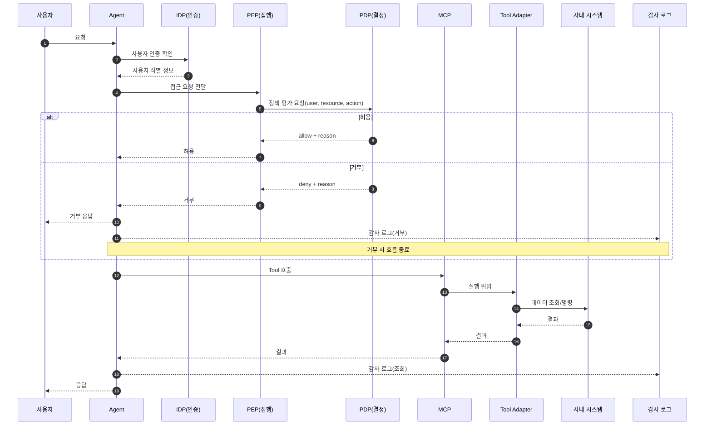
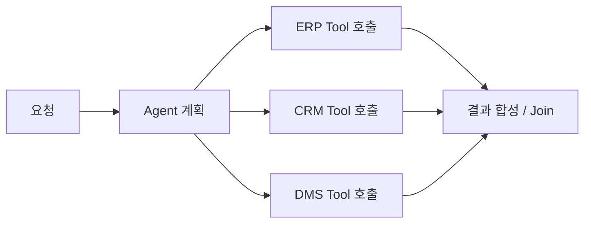
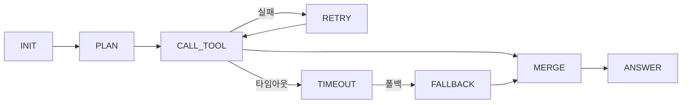

# 02. Agent/Tool/MCP 동작 흐름

## 이 챕터에서 배우는 것

- 요청이 들어왔을 때 **어떤 레이어가 무엇을 책임지는지**
- **권한 조회 vs 권한 집행**이 왜 분리되어야 하는지
- 동기/비동기, 상태 머신, 재시도 등 **컴퓨터 공학 관점의 흐름 설계**
- 장애/성능/보안 관점에서 **실무형 운영 구조** 만들기

이 문서는 **초보자부터 고급자까지** 이어지는 튜토리얼입니다.  
초급자는 전체 흐름을 이해하고, 중급 이상은 권한/상태/재시도 설계를 확인하세요.  
각 섹션은 “흐름 → 이유 → 구현 포인트” 순서로 구성됩니다.

---

## 1. 가장 기초: 요청은 어디서 시작하고 어디서 끝나는가

이 섹션은 전체 요청 흐름을 한 번에 파악하는 단계입니다.
“요청 → 실행 → 응답”의 골격을 잡으면 이후 세부 설계가 쉬워집니다.


### 1-1) 기본 요청 라이프사이클


이 흐름에서 반드시 짚어야 할 포인트는 다음입니다.

- **Agent는 판단**만 하고, **Tool은 실행**한다.
- 결과는 항상 **상태(state)에 누적**되어야 한다.
- 오류가 발생했을 때 **어디서 복구할지**를 사전에 정해야 한다.

---

## 2. 권한 관점: 조회와 집행의 분리

이 섹션은 권한 처리가 왜 Agent 내부 로직이 아닌지 설명합니다.
권한은 시스템이 집행해야 하며, Agent는 보조 역할을 한다는 점을 강조합니다.


사내 시스템 통합에서는 권한이 핵심입니다. 권한은 **다음 두 가지로 분리**합니다.

- **권한 조회**: “이 사용자가 이 리소스를 읽어도 되는가?”를 확인
- **권한 집행**: 실제로 차단/허용을 강제하는 행위

### 2-1) PDP/PEP/IDP/Policy 용어 정리

- **PDP(Policy Decision Point)**  
  정책을 평가해 **허용/거부**를 결정하는 엔진입니다. 예: “A 사용자는 고객 데이터 읽기 가능”

- **PEP(Policy Enforcement Point)**  
  PDP의 결정을 **강제로 집행**하는 지점입니다. 예: API Gateway, 서비스 미들웨어

- **IDP(Identity Provider)**  
  사용자의 신원을 확인하는 시스템입니다. 예: SSO, 사내 인증 서버

- **Policy(정책)**  
  “누가 어떤 리소스에 어떤 행동을 할 수 있는지”에 대한 규칙입니다.

SI 환경에서는 **PDP가 결정**하고, **PEP가 집행**합니다.  
Agent는 결정의 보조(설명/근거)를 제공할 수 있지만, **집행은 시스템이 강제**해야 합니다.

### 2-2) 왜 분리해야 하나

- LLM은 **결정의 근거**를 만들지만, **결정의 책임**은 시스템이 진다.
- 권한 집행은 **정책 엔진(PDP)** 에서만 이루어져야 한다.
- 감사/보안 요구사항이 있는 SI 프로젝트에서는 이 구분이 필수다.

### 2-3) 권한 포함 시퀀스



---

## 3. 컴퓨터 공학 관점: 레이어와 책임 분리

이 섹션은 시스템을 제어/실행/관측 레이어로 나누는 이유를 설명합니다.
레이어가 분리되면 장애 격리와 운영 안정성이 높아집니다.


### 3-1) 제어/실행/관측 평면

```text
[Control Plane]
  - Agent
  - 정책 엔진

[Execution Plane]
  - Tool Router
  - MCP
  - Tool Adapter
  - 내부 시스템

[Observability Plane]
  - 로그
  - 감사
  - 모니터링
```

- 제어 평면은 **결정과 정책**을 담당한다.
- 실행 평면은 **IO와 시스템 통신**을 담당한다.
- 관측 평면은 **장애 대응과 감사**의 근거다.

이 분리가 되어 있어야 **장애 원인 추적**이 가능하고, 운영이 안정적이다.

---

## 4. 동시성/비동기: 성능을 좌우하는 구조

이 섹션은 왜 병렬 처리가 필요한지, 그리고 어떤 비용이 생기는지 설명합니다.
속도와 복잡도 사이의 균형이 중요합니다.


### 4-1) 병렬 처리의 이유

- SI 환경에서는 여러 시스템(ERP, CRM, DMS)을 동시에 조회해야 한다.
- 순차 실행은 지연(latency)을 크게 늘린다.

### 4-2) 비동기 구조 예시



비동기 구조는 **성능 향상**과 동시에 **복잡도 증가**를 만든다.
따라서 다음이 필요하다.

- 타임아웃
- 재시도
- 부분 실패 처리

---

## 5. 상태 머신 관점: 일관된 흐름 만들기

이 섹션은 Agent 흐름을 상태 머신으로 보는 관점을 제공합니다.
상태 전이를 명확히 정의해야 재시도와 복구가 가능합니다.


Agent는 본질적으로 **상태 머신**으로 볼 수 있습니다.



- 각 상태는 하나의 책임만 가진다.
- 상태 전이는 **조건이 명확**해야 한다.
- 실패 상태로의 이동 경로가 반드시 있어야 한다.

---

## 6. 데이터 무결성과 멱등성

이 섹션은 실행 결과가 안전하게 관리되는 기준을 다룹니다.
중복 실행 방지와 데이터 품질 보장은 운영 안정성의 핵심입니다.


### 6-1) 멱등성

- 같은 요청이 여러 번 실행되어도 결과가 같아야 한다.
- 네트워크 오류로 재시도될 때 **중복 실행**을 막는다.

멱등성은 “**같은 입력은 같은 결과**”라는 규칙을 지키는 설계입니다.  
SI 환경에서는 네트워크 지연, 타임아웃, 재시도 때문에 **동일 요청이 여러 번 들어올 수 있습니다**.  
이때 멱등성이 없으면 아래 문제가 생깁니다.

- 결제/승인 같은 작업이 **중복 수행**
- 동일 티켓이 **여러 번 생성**
- 재시도에 의해 **데이터 불일치** 발생

실무에서 사용하는 대표적인 멱등성 전략은 다음과 같습니다.

- **Idempotency Key**: 요청마다 고유 키를 발급하고, 같은 키는 한 번만 처리  
  예: `POST /payment` 요청에 `Idempotency-Key` 헤더 사용
- **요청 로그 기반 중복 차단**: 처리된 요청 ID를 저장하고 재요청 차단
- **업무 키 기반 중복 방지**: `order_id`, `ticket_id` 같은 비즈니스 키로 중복 여부 판단

### 6-2) 데이터 무결성

- Tool 결과는 반드시 스키마를 지켜야 한다.
- 스키마가 깨지면 Agent 판단이 왜곡된다.

데이터 무결성은 “**데이터가 정확하고, 일관되며, 신뢰 가능한 상태를 유지**”하는 것을 의미합니다.  
Agent는 Tool 결과를 근거로 판단하기 때문에, 무결성이 깨지면 **잘못된 의사결정**으로 이어집니다.

무결성을 지키기 위한 핵심 포인트는 다음과 같습니다.

- **스키마 검증**: 입력/출력 데이터를 Pydantic/JSON Schema로 검증  
  예: 필수 필드 누락 시 즉시 오류 반환
- **정합성 규칙 적용**: 날짜 범위, 금액 합계 등 업무 규칙 검증
- **원천 신뢰성 확보**: 캐시/요약본만 쓰지 말고 원천 데이터 참조 가능하게 유지
- **감사 로그와 버전 관리**: 데이터 변경 히스토리를 남겨 추적 가능하게 한다

정리하면,
멱등성은 **중복 실행을 막는 설계 원칙**,  
무결성은 **잘못된 판단을 막는 데이터 품질 원칙**입니다.

---

## 7. 운영 관점: 장애, 보안, 관측

이 섹션은 장애 처리와 보안/관측 기준을 정리합니다.
실무에서는 이 기준이 없으면 운영이 불가능합니다.


### 7-1) 장애 처리

- 타임아웃: 외부 시스템 지연 방지
- 재시도: 일시적 실패에만 적용
- 폴백: 대체 데이터/요약 제공

### 7-2) 보안 처리

- 권한 조회는 Tool로 가능하지만, 집행은 정책 엔진이 수행
- 민감 정보는 마스킹 후 전달

### 7-3) 관측

- 요청 ID 기반 추적
- Tool 호출 로그/결과 로그 분리
- 감사 로그는 별도 저장소로 분리

---

## 8. 체크리스트

마지막으로 흐름 설계가 실무 기준을 충족하는지 점검합니다.


- Agent와 Tool의 책임이 분리되어 있는가?
- 권한 조회와 집행이 분리되어 있는가?
- 상태 머신 흐름이 명확한가?
- 비동기 처리 시 타임아웃/재시도 기준이 있는가?
- 스키마 무결성 검증이 존재하는가?
- 감사 로그가 남는가?
