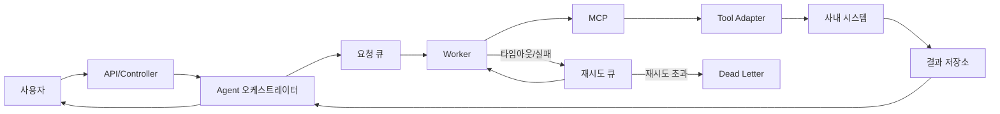
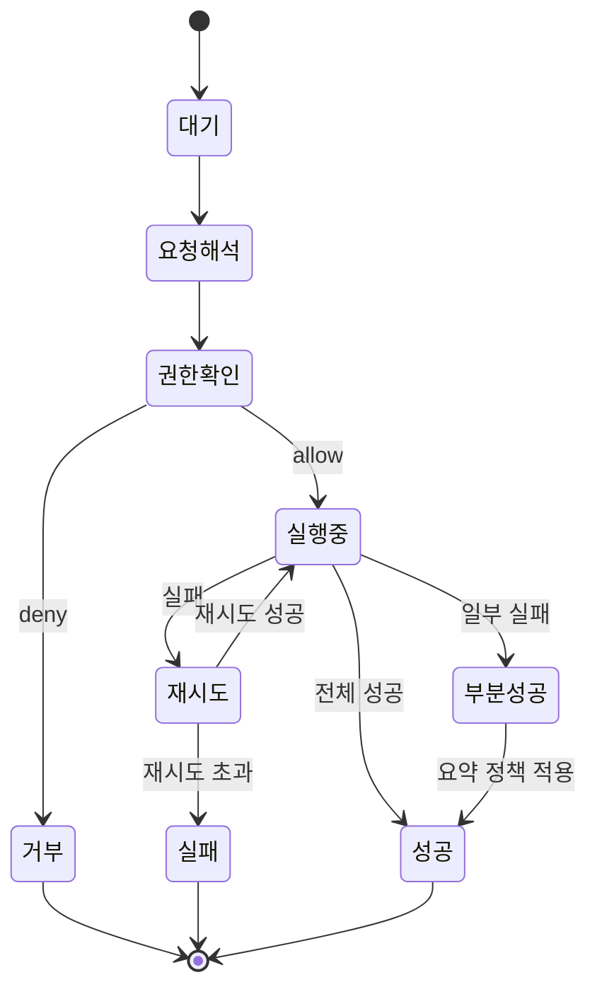

# 03. 아키텍처 설계 관점

## 이 챕터에서 배우는 것

- 실무에서 통하는 **레이어 경계** 설계 방법
- **제어/실행/관측** 책임을 분리하는 이유
- 비동기 처리와 상태 관리를 포함한 **운영형 설계**
- 폴더 구조에 책임을 매핑하는 방법

이 문서는 **초보자부터 고급자까지** 이어지는 튜토리얼입니다.  
초급자는 레이어 개념을 잡고, 중급 이상은 운영/확장 설계를 확인하세요.  
각 섹션은 “목표 → 원칙 → 적용 순서” 흐름으로 읽을 수 있습니다.

---

## 1. 설계 목표와 제약

이 섹션은 아키텍처 설계의 목표를 명확히 합니다.
성능보다 운영 안정성을 우선한다는 기준을 먼저 잡습니다.

실무 설계는 “잘 돌아가게”보다 “안정적으로 운영되게”가 더 중요합니다.

- **확장성**: Tool/시스템이 늘어나도 구조가 흔들리지 않는다.
- **장애 격리**: 한 컴포넌트 실패가 전체로 확산되지 않는다.
- **보안/감사**: 누가 무엇을 했는지 추적할 수 있다.
- **운영 단순성**: 장애 원인과 복구 지점을 쉽게 찾을 수 있다.

---

## 2. 레이어 아키텍처

이 섹션은 제어/실행/관측 레이어의 의미를 정리합니다.
레이어를 나누는 이유와 책임 경계를 설명합니다.

실무에서는 제어/실행/관측을 레이어로 분리해 설계합니다.

- **제어 평면**: Agent, 정책 엔진, 정책 집행(PEP)
- **실행 평면**: MCP, Tool Router, Tool Adapter, 내부 시스템
- **관측 평면**: 로그, 감사, 모니터링, 추적

이렇게 나누면 **책임과 장애 경계**가 명확해지고, 운영이 단순해집니다.

---

## 3. 경계 설계 원칙

이 섹션은 경계가 왜 중요한지와 설계 원칙을 설명합니다.
경계가 무너지면 책임도 흐려진다는 점을 강조합니다.

- **인터페이스 고정**: Tool 입력/출력 스키마는 쉽게 바뀌지 않아야 한다.
- **정책 집행 위치 고정**: 최종 허용/거부는 PEP에서 강제한다.
- **Agent는 결정만**: 데이터 접근과 가공은 Tool이 담당한다.
- **외부 의존 분리**: MCP와 외부 시스템은 어댑터 뒤로 숨긴다.
- **실패 전파 제어**: 타임아웃, 재시도, 데드레터를 명시한다.

---

## 4. 서버 수준 설계 관점

이 섹션은 서버 단위에서 어떤 선택을 해야 하는지 다룹니다.
장애 격리와 리소스 보호가 핵심입니다.

서버 관점에서는 **성능보다 안정성**을 우선합니다. 특히 “장애 시 확산을 막는 구조”가 핵심입니다.

### 4-1) 설계 진행 순서

1. **격리 경계부터 정한다**: Agent 서버, MCP 서버, Tool Adapter 서버를 분리해 장애 확산을 막는다.
2. **리소스 보호 경로를 만든다**: 외부 호출은 워커/큐로 분리해 웹 요청을 보호한다.
3. **상태 저장 위치를 고정한다**: 실행 상태는 서버 메모리가 아니라 저장소에 기록한다.
4. **스케일 전략을 정한다**: Agent는 수평 확장, Tool Adapter는 대상 시스템별 확장 정책을 둔다.
5. **관측 기준을 통일한다**: 호출 경로에 trace_id를 부여해 전체 흐름을 연결한다.

---

## 5. Agent 개발자 관점: 통신과 운영

이 섹션은 Agent 개발자가 운영을 위해 챙겨야 할 항목을 정리합니다.
타임아웃/재시도/멱등 키 등 실무 필수 요소가 포함됩니다.

Agent는 “정확한 결정을 내리는 컴포넌트”일 뿐, **통신 안정성**은 시스템 설계에 의존합니다.  
아래는 Agent 관점에서 따라야 할 **설계 진행 순서**입니다.

1. **타임아웃을 정의한다**: Tool/MCP별 타임아웃을 다르게 둔다.
2. **재시도 조건을 구분한다**: 읽기/쓰기 작업을 구분해 재시도 여부를 결정한다.
3. **멱등 키를 설계한다**: 재시도 시 중복 실행을 막기 위한 키를 사용한다.
4. **부분 성공 정책을 둔다**: 일부 실패 시 요약 정책을 명시한다.
5. **오류 변환 규칙을 둔다**: 내부 오류를 사용자 메시지로 변환한다.

---

## 6. Tool 설계 관점

이 섹션은 Tool 설계를 위한 기준을 정리합니다.
입출력 스키마와 실패 정책을 중심으로 설명합니다.

Tool은 “실행 단위”이므로 **입력/출력 스키마와 실패 정책**이 핵심입니다.  
아래는 Tool 설계를 위한 **설계 진행 순서**입니다.

1. **스키마를 고정한다**: 필드명과 타입을 쉽게 바꾸지 않는다.
2. **에러 코드를 표준화한다**: 재시도 가능/불가능을 구분한다.
3. **부작용을 명시한다**: 읽기/쓰기 여부를 명확히 구분한다.
4. **성능 계약을 정한다**: 평균/최대 응답 시간 기대치를 문서화한다.
5. **감사 로그를 연동한다**: 중요한 작업은 반드시 감사 로그로 남긴다.

---

## 7. MCP 설계와 활용 관점

MCP는 Tool의 “게이트웨이”이므로 **발견/호출/통제**가 일관되어야 합니다.  
아래는 MCP 설계를 위한 **설계 진행 순서**입니다.

1. **도구 발견 규칙을 정한다**: Tool 목록과 스키마를 버전으로 관리한다.
2. **접근 제어 위치를 고정한다**: 인증/권한 체크는 MCP 앞단에서 일관되게 처리한다.
3. **호출 정책을 정의한다**: 호출 제한, 동시성 제한, 회로 차단을 둔다.
4. **관측 표준을 강제한다**: 요청/응답 로그에 공통 필드를 강제한다.
5. **점진적 공개 전략을 둔다**: 필요한 Tool만 노출한다.

---

## 8. 비동기 구조 예시

비동기 설계는 **부하 완충**과 **장애 격리**에 효과적입니다.



- 큐는 **순간 트래픽 폭주**를 흡수한다.
- 재시도 큐는 **일시 장애**를 완화한다.
- 데드레터는 **운영자가 확인할 실패**를 분리한다.

---

## 9. 상태 머신 관점

Agent의 의사결정 흐름을 상태로 정의하면 **실패 복구 기준**이 명확해집니다.



- 상태와 전이가 문서화되면 **운영 대응 속도**가 빨라집니다.
- 재시도와 부분 성공 정책이 **코드와 문서에 일치**해야 합니다.

---

## 10. 운영·보안 체크포인트

- 감사 로그는 **누가/언제/무엇을** 남기는가?
- Tool 실패는 **사용자에게 어떻게 전달**되는가?
- MCP 장애 시 **대체 경로**가 있는가?
- PEP는 **모든 외부 요청**을 통제하는가?
- 민감 데이터는 **마스킹/접근 통제**가 있는가?

---

## 11. 폴더 구조 매핑 예시

```text
src/
  app/
    api/               # HTTP 엔드포인트
    agent/             # Agent 오케스트레이션
    policies/          # PDP/PEP 연동 로직
    tools/             # Tool 인터페이스와 구현
    adapters/          # MCP/외부 시스템 어댑터
    observability/     # 로그/감사/모니터링
    core/              # 도메인 로직
```

---

## 12. 체크리스트

- Agent/Tool 경계가 모듈로 분리되어 있는가?
- 인터페이스 스키마가 안정적으로 고정되어 있는가?
- 정책 집행 위치가 명확하게 고정되어 있는가?
- 비동기 실패 처리(재시도/데드레터)가 정의되어 있는가?
- Tool 오류 코드와 재시도 정책이 표준화되어 있는가?
- MCP에서 호출 제한/동시성 제한이 정의되어 있는가?
- 상태 머신 전이가 문서와 코드에 일치하는가?
- 로그/감사 데이터의 기준이 정의되어 있는가?
