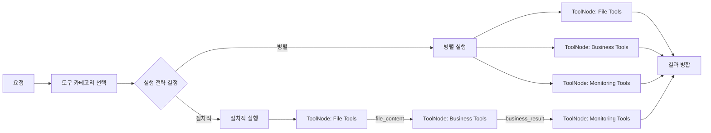

# 01. LangGraph 기본

## 이 챕터에서 배우는 것

- Agent가 **실제로 수행해야 하는 역할**과 책임 범위
- LangGraph에서 Agent 역할을 **구성 요소로 매핑**하는 방법
- `@tool` 데코레이터가 LLM에 **어떤 정보를 전달**하고 어떻게 호출되는지
- 파일 읽기/쓰기 Tool 예제와 실무 주의사항
- Tool 카탈로그 분할 전략과 **여러 ToolNode** 설계 패턴

---

## 1. Agent는 무엇을 해야 하는가

Agent는 단순한 챗봇이 아니라 **의사결정 + 실행 오케스트레이션** 역할을 수행합니다.
여기서 “오케스트레이션”은 단순히 순서를 정하는 것뿐 아니라, 실패 시 복구와 정책 준수까지 포함합니다.
즉, Agent는 응답 생성만이 아니라 “어떤 행동을 언제 하는지”를 책임지는 구조입니다.
초급자는 이 역할을 “요청을 이해하고 도구를 호출하는 흐름”으로 이해하면 충분합니다.
고급자는 이를 **운영 가능한 제어 흐름**으로 확장해 장애와 비용까지 통제해야 합니다.

핵심 역할은 다음과 같습니다.

1) **요청 이해/목표 정의**  
   사용자의 요청을 구조화하고 목표를 정리한다.

2) **계획 수립(Plan)**  
   필요한 Tool과 실행 순서를 결정한다.

3) **Tool 선택/호출**  
   어떤 Tool을 언제 호출할지 결정하고 실행한다.

4) **결과 합성/검증**  
   Tool 결과를 합치고 품질을 평가한다.

5) **안전장치/정책 준수**  
   권한, 금지 규칙, 비용 제한을 위반하지 않도록 제어한다.

6) **관측성과 기록**  
   실패/재시도/결과 로그를 남겨 운영 가능하게 만든다.

---

## 2. LangGraph에서 역할을 어떻게 구현하는가

아래는 역할 → LangGraph 구성 요소 매핑입니다.
이 매핑을 이해하면 “어떤 책임을 어디에 둬야 하는지”가 명확해집니다.
역할을 분리하면 실패 원인을 빠르게 찾을 수 있고 테스트 범위도 줄어듭니다.
또한 책임 경계를 명확히 하면 팀 간 협업에도 도움이 됩니다.
그래프가 커져도 유지보수가 쉬워지는 이유가 여기에 있습니다.

| 역할 | LangGraph 구성요소 |
| --- | --- |
| 요청 이해 | Planner Node |
| Tool 선택 | Router Node |
| Tool 호출 | ToolNode 또는 Custom Node |
| 결과 합성/검증 | Merge/Validate Node |
| 안전장치/정책 준수 | Guard Node (pre/post) |
| 관측성/기록 | Logging Node 또는 Hook |

이렇게 역할을 분리하면 **실무에서 유지보수 가능한 구조**가 됩니다.

---

## 3. `@tool` 데코레이터가 실제로 하는 일

`@tool`은 단순한 장식자가 아니라, **LLM이 이해할 수 있는 도구 스키마를 생성**하는 역할을 합니다.
즉, Tool이 제대로 작동하는지 여부는 **도구 설명과 입력 스키마의 품질**에 크게 좌우됩니다.
설명이 모호하면 모델은 잘못된 Tool을 선택할 수 있습니다.
스키마가 느슨하면 입력 오류가 늘어나고 디버깅이 어려워집니다.
따라서 `@tool`을 쓸 때는 설명과 스키마를 “제품 스펙”처럼 다뤄야 합니다.

### 3-1) LLM에 전달되는 정보

`@tool`로 정의된 Tool은 아래 정보가 LLM에 전달됩니다.

- **name**: Tool 이름
- **description**: Tool 설명(LLM이 언제 쓰는지 판단 기준)
- **args schema**: 입력 파라미터 구조(타입/필드/설명)

즉, LLM은 “이런 이름과 설명을 가진 도구가 있고, 이런 입력 구조를 요구한다”는 정보를 받습니다.

### 3-2) 실제 호출 흐름

1) LLM은 `tool_calls`를 포함한 응답을 생성한다.
2) LangGraph의 ToolNode가 `tool_calls`를 실행한다.
3) Tool 실행 결과가 **messages state**에 ToolMessage로 추가된다.
4) LLM은 Tool 결과를 보고 다음 행동을 결정한다.

---

## 4. `@tool` 기반 파일 읽기/쓰기 예제

아래는 **파일 읽기/쓰기** Tool 예시입니다. 실무에서는 반드시 경로 제한과 보안 검증을 추가해야 합니다.
이 예시는 “도구 스키마 → 실제 실행”이 어떻게 연결되는지를 보여주는 최소 예시입니다.
초급자는 이 예시로 Tool의 입력/출력 구조를 이해하면 됩니다.
중급 이상은 파일 경로 검증과 감사 로그를 추가하는 방향으로 확장해야 합니다.
즉, 예시는 시작점일 뿐이며 운영 환경에서는 강화가 필수입니다.

```python
"""
목적: 파일 읽기/쓰기 Tool 예시를 제공한다.
설명: 실제 서비스에서는 경로 제한과 권한 검증이 필수다.
디자인 패턴: Command
"""

from langchain_core.tools import tool


@tool
def read_file(path: str) -> str:
    """지정한 파일을 읽어 문자열로 반환한다."""
    with open(path, "r", encoding="utf-8") as f:
        return f.read()


@tool
def write_file(path: str, content: str) -> str:
    """지정한 파일에 내용을 저장한다."""
    with open(path, "w", encoding="utf-8") as f:
        f.write(content)
    return "ok"
```

실무 팁:

- **허용 경로(화이트리스트)** 를 반드시 적용한다.
- 민감 파일(인증키/설정)은 접근 금지 목록을 둔다.
- 쓰기 Tool은 감사 로그를 남긴다.

---

## 5. 여러 Tool 등록과 연결

도구가 하나일 때는 단순하지만, 여러 도구를 연결할 때부터 설계 품질이 드러납니다.
이 섹션은 “Tool 등록 → ToolNode → 조건부 분기”라는 기본 패턴을 익히는 데 목적이 있습니다.
초급자는 이 패턴을 이해하면 대부분의 작은 프로젝트를 구성할 수 있습니다.
중급 이상은 Tool 수 증가에 따른 라우팅 품질을 고려해야 합니다.
결국 이 구조는 확장성과 안정성을 동시에 확보하기 위한 기반입니다.

### 5-1) ToolNode 사용하기

```python
from langgraph.prebuilt import ToolNode

tools = [read_file, write_file]
tool_node = ToolNode(tools)

builder.add_node("tools", tool_node)
```

참고 설명:

- `builder`는 `StateGraph` 인스턴스로, 그래프에 노드를 추가하는 컨테이너입니다.
- `tools` 리스트는 ToolNode가 실행할 도구 묶음입니다.

### 5-2) LLM에 도구 바인딩하기

```python
from langchain_openai import ChatOpenAI

model = ChatOpenAI(model="gpt-4o-mini")
tools = [read_file, write_file]
model_with_tools = model.bind_tools(tools)
```

### 5-3) 조건부 엣지로 Tool 호출 여부 분기하기

```python
from langgraph.prebuilt import tools_condition

builder.add_conditional_edges(
    "agent",
    tools_condition,
)
```

운영 팁:

- 도구 수가 늘어날수록 **description을 명확히** 작성해야 모델이 혼동하지 않습니다.
- 너무 많은 Tool을 한 번에 노출하면 선택 품질이 떨어질 수 있습니다.

---

## 6. Tool 카탈로그 분할 전략

Tool이 많아지면 하나의 ToolNode에 모두 넣는 방식은 품질이 떨어집니다. 실무에서는 카탈로그를 분리합니다.
카탈로그 분리는 **도구 선택 품질**과 **보안 통제**를 동시에 개선하는 실무 전략입니다.
도구가 많을수록 LLM이 올바르게 선택할 확률이 낮아지기 때문입니다.
분리를 통해 도구의 범위를 좁히면 정확도가 올라갑니다.
또한 민감 도구를 별도 카탈로그로 두면 정책 통제가 쉬워집니다.

분할 전략 예시:

- **도메인 기반 분리**: 파일/문서, CRM, ERP, 모니터링 등
- **권한 레벨 분리**: 일반 조회 vs 민감/관리자 전용
- **비용 기반 분리**: 무료/저비용 Tool vs 고비용 Tool

이 분리는 **Tool 선택 품질**과 **보안 통제**를 동시에 개선합니다.

---

## 7. 여러 ToolNode로 역할 분리하기

카탈로그 분할을 실제로 반영하려면 **여러 ToolNode를 두고 라우팅**해야 합니다.
이 구조는 “도구가 늘어날수록 Agent가 혼란스러워진다”는 문제를 해결합니다.
라우팅이 있으면 특정 도구 집합만 노출할 수 있습니다.
결과적으로 도구 선택 정확도가 올라가고 비용도 줄어듭니다.
운영에서는 라우팅 기준이 곧 정책 기준이 됩니다.



병렬/절차적 실행을 선택하는 기준은 다음과 같이 정리할 수 있습니다.

- **병렬 실행이 적합한 경우**
  - 각 Tool이 **서로 독립적인 입력**을 사용한다.
  - 순서를 보장할 필요가 없고, 결과를 **나중에 합성**하면 된다.
  - 지연(latency)이 중요한 요청(SLA 민감 요청)이다.
  - 예: ERP/CRM/DMS를 동시에 조회하여 요약하는 경우

- **절차적 실행이 적합한 경우**
  - 다음 Tool이 **이전 Tool의 출력**을 입력으로 사용한다.
  - 업무 규칙상 **순서가 의미**를 가진다(예: 권한 확인 후 조회).
  - 실패 시 **중단/롤백**이 필요한 작업이다.
  - 예: 파일 읽기 → 내용 파싱 → 결과 저장 같은 파이프라인

즉, **입력 의존성이 있으면 절차적**,  
**독립적인 조회/수집이면 병렬**이 기본 원칙입니다.

이 구조는 다음 장점이 있습니다.

- 카탈로그가 커져도 선택 품질이 유지됨
- 민감 도구와 일반 도구를 분리해 보안 강화
- 도구별 운영 정책(타임아웃/재시도)을 달리 적용 가능

---

## 8. Tool 선택을 그래프 내부에서 제어하기

실무에서는 “모델이 알아서 Tool을 고르도록”만 두면 위험합니다.
따라서 그래프 설계 단계에서 **정책 기반 선택**을 넣어야 운영 리스크를 줄일 수 있습니다.
정책 기반 선택은 “허용된 범위 안에서만 선택하도록 제한”하는 구조입니다.
이렇게 하면 비용이 큰 도구나 민감 도구의 오용을 줄일 수 있습니다.
결국 정책 기반 선택은 안정적인 운영을 위한 필수 장치입니다.

- 잘못된 Tool 호출은 **보안/비용 리스크**로 이어진다.
- 특정 Tool은 **권한 기반**으로만 허용되어야 한다.

따라서 Tool 선택 로직을 **그래프 내부에서 제어**하는 설계가 필요합니다.

### 8-1) 규칙 기반 Router

```python
"""
목적: 규칙 기반으로 Tool을 선택한다.
설명: 요청 키워드에 따라 Tool 카테고리를 결정한다.
디자인 패턴: 라우터
"""

def select_category_by_rule(state: dict) -> str:
    query = state["query"]
    if "파일" in query:
        return "file_tools"
    if "고객" in query:
        return "business_tools"
    return "monitoring_tools"
```

### 8-2) LLM 기반 선택 + 정책 필터

```python
"""
목적: LLM 선택 후 정책 필터로 통제한다.
설명: 최종 선택은 정책 규칙을 통과해야 한다.
디자인 패턴: 정책 기반 선택
"""

ALLOWED_BY_ROLE = {
    "user": {"file_tools"},
    "admin": {"file_tools", "business_tools", "monitoring_tools"},
}


def select_category_with_policy(state: dict) -> str:
    role = state["role"]
    choice = "business_tools"  # 실제로는 LLM이 선택
    if choice in ALLOWED_BY_ROLE.get(role, set()):
        return choice
    return "file_tools"
```

LLM 기반 선택은 **특정 모델 제공자에 종속되지 않게** 설계하는 것이 좋습니다.
핵심은 “도구 카탈로그를 프롬프트에 주입하고, 카테고리 이름만 반환하게 하는 것”입니다.
아래 예시는 이해를 돕기 위해 ChatOpenAI를 사용했지만, 다른 제공자도 동일한 패턴으로 구현할 수 있습니다.
즉, 프롬프트와 출력 파서 구조가 핵심이며 모델 교체는 상대적으로 쉽습니다.
이 관점이 있어야 도입 후에도 모델 교체 비용을 줄일 수 있습니다.

```python
"""
목적: LLM으로 Tool 카테고리를 선택한다.
설명: Tool 카탈로그와 질문을 함께 전달한다.
디자인 패턴: 정책 기반 선택
"""

from textwrap import dedent
from langchain_openai import ChatOpenAI
from langchain_core.prompts import PromptTemplate
from langchain_core.output_parsers import StrOutputParser


_PROMPT = dedent(
    """
    너는 도구 선택 전문가다.
    아래 Tool 카탈로그에서 질문에 가장 적합한 카테고리 이름 1개만 선택하라.
    규칙:
    - 출력은 반드시 카테고리 이름만 작성한다.
    - 설명 문장 없이 이름만 반환한다.
    질문: {{question}}
    Tool 카탈로그:
    {{tool_catalog}}
    """
).strip()
_SELECT_TOOL_PROMPT = PromptTemplate.from_template(_PROMPT)


def select_category_by_llm(question: str, tool_catalog: str) -> str:
    llm = ChatOpenAI(model="gpt-4o-mini", temperature=0)
    return (_SELECT_TOOL_PROMPT | llm | StrOutputParser()).invoke(
        {"question": question, "tool_catalog": tool_catalog}
    )
```

레지스트리 기반 연동 예시:

```python
"""
목적: Registry에서 카탈로그를 뽑아 LLM 프롬프트에 반영한다.
설명: render_catalog 출력이 곧 tool_catalog로 사용된다.
디자인 패턴: Adapter
"""

tool_catalog = registry.render_catalog()
choice = select_category_by_llm(question, tool_catalog)
```

### 8-3) Registry → Prompt 연동 흐름 정리

```text
ToolRegistry.register(...) 
   ↓
ToolRegistry.render_catalog()
   ↓
LLM Prompt(tool_catalog에 주입)
   ↓
LLM이 Tool 선택
```

핵심 포인트:

- Tool 추가/삭제는 **Registry만 수정**한다.
- 프롬프트는 **render_catalog 결과를 그대로 사용**한다.
- 선택 품질은 **Tool 설명/스키마의 명확성**에 좌우된다.

---

## 9. 실무 설계 체크포인트

아래 체크포인트는 실무에서 자주 발생하는 실패를 사전에 줄이기 위한 최소 기준입니다.
체크리스트를 통과하지 못하면 운영 리스크가 커질 가능성이 높습니다.
특히 Tool 수가 증가하는 시점에는 체크리스트가 필수입니다.
초급자는 체크리스트로 설계를 검증하고, 고급자는 이를 자동화하는 방향으로 확장합니다.
결과적으로 체크리스트는 팀 내 품질 기준을 통일하는 역할을 합니다.

- Tool 이름/설명/스키마가 LLM 친화적인가?
- Tool 카탈로그가 과도하게 비대하지 않은가?
- 카테고리별로 ToolNode를 분리했는가?
- Tool 선택 로직이 정책(권한/비용)을 반영하는가?
- Tool 호출 실패 시 재시도/폴백이 정의되어 있는가?

---

## 10. 요약

이 장의 핵심은 “도구를 많이 붙이는 것”이 아니라, **역할과 책임을 분리해 운영 가능하게 만드는 것**입니다.
도구 수가 늘수록 역할 분리가 더 중요해집니다.
정책과 실행을 분리하지 않으면 장애 전파가 빨라집니다.
따라서 구조 설계가 품질을 좌우합니다.
요약하면, LangGraph는 단순히 연결하는 도구가 아니라 **운영 가능한 구조를 만드는 틀**입니다.

- Agent는 “판단 + 실행 오케스트레이션” 역할을 맡는다.
- `@tool`은 **LLM에 전달되는 도구 스키마**를 만든다.
- Tool이 많아질수록 **카탈로그 분할**과 **여러 ToolNode 구조**가 필요하다.
- Tool 선택 로직은 **그래프 내부에서 통제**하는 것이 실무에 적합하다.
