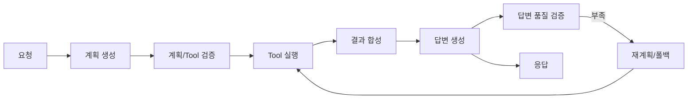
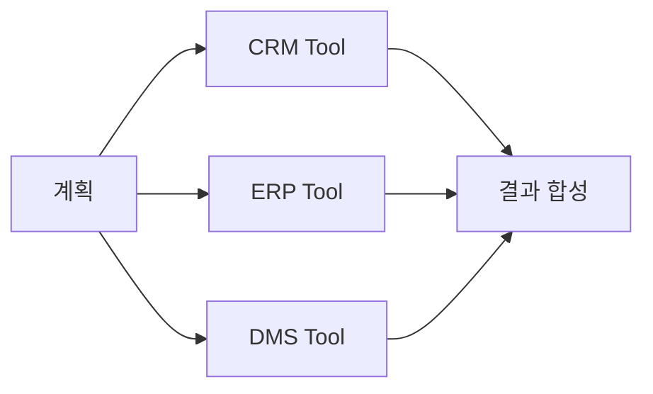

# 02. Plan-and-Execute Agent

## 이 챕터에서 배우는 것

- 계획(Plan)을 **실행 가능한 인터페이스**로 설계하는 방법
- 계획과 Tool이 **일치하는지 검증**하는 기준과 구현 포인트
- 병렬/절차 실행을 구분한 **실무형 실행 전략**
- 상태(State)와 로그 정책을 포함한 **운영 가능한 전체 구조**

---

## 1. 전체 워크플로 개요

Plan-and-Execute Agent는 아래 흐름으로 동작합니다.
이 구조는 “계획 → 실행 → 검증”을 명확히 분리해, 실패 지점을 구체적으로 추적할 수 있게 합니다.
초급자는 이 흐름을 **문제 해결의 기본 뼈대**로 이해하면 됩니다.
중급자는 각 단계에 필요한 입력과 출력이 무엇인지 정의하는 데 집중해야 합니다.
고급자는 **정책/관측 노드**를 추가해 운영 관점으로 확장해야 합니다.



---

## 2. 계획 설계

계획은 “무엇을 어떤 순서로 실행할지”를 정의하는 **실행 인터페이스**입니다.
계획이 모호하면 실행이 실패하고, 로그/감사 추적도 불가능해집니다.
따라서 계획은 단순한 텍스트가 아니라 **검증 가능한 구조**로 설계되어야 합니다.

### 2-1) 계획 포맷

```json
{
  "steps": [
    {"id": 1, "action": "tool_call", "tool": "crm_get_customer", "input": {"customer_id": "C-100"}},
    {"id": 2, "action": "tool_call", "tool": "erp_get_invoice", "input": {"customer_id": "C-100"}},
    {"id": 3, "action": "merge", "input": {"policy": "partial_ok"}},
    {"id": 4, "action": "answer", "input": {"style": "brief"}}
  ]
}
```

### 2-2) 설계 원칙

- **고정 스키마**: action/tool/input 필드를 강제한다.
- **순서 보장**: id로 순서와 재시도 추적을 가능하게 한다.
- **의존성 명시**: 후속 step이 이전 결과를 쓰면 input에 명시한다.

### 2-3) LLM 기반 Plan 생성 예시 (ChatOpenAI)

```python
"""
목적: LLM으로 Plan을 생성한다.
설명: 출력은 JSON 형식의 steps로 고정한다.
디자인 패턴: Planner
"""

from textwrap import dedent
from langchain_openai import ChatOpenAI
from langchain_core.prompts import PromptTemplate
from langchain_core.output_parsers import StrOutputParser


_PROMPT = dedent(
    """
    너는 실행 가능한 Plan을 만드는 역할이다.
    아래 규칙을 반드시 지켜서 JSON만 출력하라.
    규칙:
    - steps는 배열이어야 한다.
    - 각 step은 id/action/tool/input을 포함해야 한다.
    - tool은 제공된 Tool 목록 중에서만 선택한다.
    - output_key는 후속 단계가 참조할 때만 포함한다.
    질문: {{question}}
    Tool 목록: {{tool_list}}
    """
).strip()
_PLAN_PROMPT = PromptTemplate.from_template(_PROMPT)


def build_plan_with_llm(question: str, tool_list: str) -> str:
    llm = ChatOpenAI(model="gpt-4o-mini", temperature=0)
    return (_PLAN_PROMPT | llm | StrOutputParser()).invoke(
        {"question": question, "tool_list": tool_list}
    )
```

---

## 3. 계획과 Tool 일치 검증

계획이 실행 가능한지 확인하려면 **Tool 일치 검증**이 필요합니다.
이 단계가 없으면 LLM이 만들어낸 계획이 실행 단계에서 에러를 발생시킬 가능성이 생깁니다. 따라서 검증은 실행 전에 문제를 발견하는 **가장 저렴한 안전장치**입니다.
검증 결과는 재계획 여부를 판단하는 핵심 신호가 되며, 실무에서는 검증 실패 로그가 품질 개선의 출발점이 됩니다.

### 3-1) 검증 기준

- 계획에 등장한 tool이 **등록된 Tool**인지
- 입력 스키마가 Tool 요구사항을 **만족**하는지
- 실행 순서가 **정책/권한 규칙**을 위반하지 않는지
- 호출 비용/횟수가 **정책 한도**를 넘지 않는지

### 3-2) 검증 예시

```python
"""
목적: 계획과 Tool의 일치 여부를 검사한다.
설명: 등록된 Tool, 입력 스키마, 권한/비용 제한을 확인한다.
디자인 패턴: Validator
"""

def validate_plan(plan: dict, tool_registry: dict, allowed_tools: set[str]) -> bool:
    steps = plan.get("steps", [])
    if not steps:
        return False
    for step in steps:
        tool_name = step.get("tool")
        if tool_name:
            if tool_name not in tool_registry:
                return False
            if tool_name not in allowed_tools:
                return False
        if "input" not in step:
            return False
    return True
```

---

## 4. 실행 전략: 병렬 vs 절차

실행은 “도구 호출”만의 문제가 아니라 **전략 선택**이 핵심입니다.
여기서 병렬/절차 전략은 성능과 안정성의 균형을 맞추는 결정입니다.
병렬은 빠르지만 부분 실패가 발생할 수 있습니다.
절차는 안정적이지만 지연이 길어질 수 있습니다.
따라서 전략 선택은 요청의 목적과 위험도를 함께 고려해야 합니다.

### 4-1) 병렬 실행

독립적인 Tool을 동시에 실행해 지연을 줄입니다.



### 4-2) 절차적 실행

이전 결과가 다음 Tool의 입력인 경우 순차 실행이 필요합니다.


### 4-3) 실행 전략 선택 기준

- **입력 의존성 존재** → 절차적
- **독립 조회/수집** → 병렬
- **SLA 민감 요청** → 병렬 우선

---

### 4-4) Plan-and-Execute 구현 예시(최소 동작)

아래 코드는 **계획 생성 → 검증 → 실행 → 합성 → 답변** 흐름을 한 번에 보여주는 최소 예시입니다.  
초급자는 전체 흐름을 이해하는 데 집중하고, 고급자는 각 노드를 분리/확장하는 방향으로 발전시키면 됩니다.  
이 예시는 “완전한 제품”이 아니라 **동작 구조를 이해하기 위한 스켈레톤**입니다.  
실무에서는 상태 스키마를 더 엄격히 하고, 에러/재시도/감사를 추가해야 합니다.  
그래도 이 골격을 이해하면 LangGraph 기반 에이전트를 확장하는 데 큰 도움이 됩니다.

```python
"""
목적: Plan-and-Execute 최소 구현 예시를 제공한다.
설명: 계획 생성/검증/실행/합성/답변을 순서대로 연결한다.
디자인 패턴: Planner + Executor + Merger
"""

from typing import Any, TypedDict
from langgraph.graph import StateGraph, END


class AgentState(TypedDict):
    request: str
    plan: dict
    tool_results: list[dict]
    answer: str
    errors: list[str]


def tool_search_docs(query: str) -> dict:
    return {"docs": [f"{query} 문서1", f"{query} 문서2"]}


def tool_get_customer(customer_id: str) -> dict:
    return {"customer_id": customer_id, "status": "active"}


TOOL_REGISTRY = {
    "search_docs": tool_search_docs,
    "get_customer": tool_get_customer,
}


def node_plan(state: AgentState) -> dict:
    plan = {
        "steps": [
            {"id": 1, "tool": "get_customer", "input": {"customer_id": "C-1001"}},
            {"id": 2, "tool": "search_docs", "input": {"query": "계약 상태"}},
        ]
    }
    return {"plan": plan}


def node_validate(state: AgentState) -> dict:
    plan = state.get("plan", {})
    steps = plan.get("steps", [])
    for step in steps:
        if step.get("tool") not in TOOL_REGISTRY:
            return {"errors": [f"unknown tool: {step.get('tool')}"]}
    return {}


def node_execute(state: AgentState) -> dict:
    results: list[dict] = []
    for step in state["plan"]["steps"]:
        tool = TOOL_REGISTRY[step["tool"]]
        results.append(tool(**step["input"]))
    return {"tool_results": results}


def node_merge(state: AgentState) -> dict:
    merged = {"results": state.get("tool_results", [])}
    return {"tool_results": [merged]}


def node_answer(state: AgentState) -> dict:
    return {"answer": f"결과 요약: {state.get('tool_results')}"}


builder = StateGraph(AgentState)
builder.add_node("plan", node_plan)
builder.add_node("validate", node_validate)
builder.add_node("execute", node_execute)
builder.add_node("merge", node_merge)
builder.add_node("answer", node_answer)

builder.set_entry_point("plan")
builder.add_edge("plan", "validate")
builder.add_edge("validate", "execute")
builder.add_edge("execute", "merge")
builder.add_edge("merge", "answer")
builder.add_edge("answer", END)

graph = builder.compile()
```

실무 포인트

- `node_validate`가 없으면 **잘못된 Tool 호출**이 실행 단계까지 내려간다.
- `node_merge`는 **partial/strict 정책**을 반영하는 지점이다.
- 실제 환경에서는 `node_plan`과 `node_answer`를 LLM 호출로 대체한다.

---

### 4-5) LLM 기반 계획/답변 노드 예시

아래 예시는 `node_plan`과 `node_answer`를 **LLM 호출로 대체**하는 구조입니다.  
모델 제공자는 바뀔 수 있으므로, 프롬프트/파서 구조를 중심으로 이해하는 것이 중요합니다.  
초급자는 구조를 이해하고, 고급자는 프롬프트/파서/검증 로직을 강화하면 됩니다.  
계획 생성과 답변 생성은 서로 다른 목적이므로 프롬프트를 분리하는 것이 안전합니다.  
또한 출력 형식을 고정해야 실행과 검증이 안정됩니다.

```python
"""
목적: LLM 기반 계획/답변 노드를 구현한다.
설명: JSON 출력과 답변 생성 프롬프트를 분리한다.
디자인 패턴: Planner + Generator
"""

from textwrap import dedent
from langchain_core.prompts import PromptTemplate
from langchain_core.output_parsers import StrOutputParser
from langchain_openai import ChatOpenAI


PLAN_PROMPT = PromptTemplate.from_template(
    dedent(
        """
        너는 실행 가능한 Plan을 만든다.
        출력은 반드시 JSON만 허용한다.
        규칙:
        - steps는 배열이어야 한다.
        - 각 step은 id/tool/input을 포함한다.
        질문: {question}
        Tool 목록: {tool_list}
        """
    ).strip()
)

ANSWER_PROMPT = PromptTemplate.from_template(
    dedent(
        """
        너는 결과를 요약해 답변을 만든다.
        규칙:
        - 근거가 없으면 부족함을 명시한다.
        - 출력은 간단한 문장으로 작성한다.
        결과: {results}
        """
    ).strip()
)


def node_plan_llm(state: AgentState) -> dict:
    llm = ChatOpenAI(model="gpt-4o-mini", temperature=0)
    tool_list = ", ".join(TOOL_REGISTRY.keys())
    plan_json = (PLAN_PROMPT | llm | StrOutputParser()).invoke(
        {"question": state["request"], "tool_list": tool_list}
    )
    return {"plan": {"raw": plan_json}}


def node_answer_llm(state: AgentState) -> dict:
    llm = ChatOpenAI(model="gpt-4o-mini", temperature=0)
    answer = (ANSWER_PROMPT | llm | StrOutputParser()).invoke(
        {"results": state.get("tool_results", [])}
    )
    return {"answer": answer}
```

---

### 4-6) 병렬/절차 분기 실행 예시

아래 예시는 plan의 `strategy` 값에 따라 **병렬/절차 실행을 분기**합니다.  
병렬 실행은 `asyncio.gather`를 사용하고, 절차 실행은 순차 처리합니다.  
초급자는 흐름만 이해하고, 고급자는 에러/재시도 정책을 추가하면 됩니다.  
분기 로직을 명시적으로 두면 실행 경로가 투명해집니다.  
이 구조는 운영에서 원인 추적을 쉽게 해줍니다.

```python
"""
목적: plan.strategy에 따라 실행 경로를 분기한다.
설명: parallel이면 gather, 아니면 순차 실행한다.
디자인 패턴: Strategy
"""

import asyncio


async def execute_steps_by_strategy(plan: dict) -> list[dict]:
    steps = plan.get("steps", [])
    strategy = plan.get("strategy", "sequential")

    async def _run(step: dict) -> dict:
        tool = TOOL_REGISTRY[step["tool"]]
        return tool(**step["input"])

    if strategy == "parallel":
        return await asyncio.gather(*[_run(s) for s in steps])

    results: list[dict] = []
    for step in steps:
        results.append(await _run(step))
    return results
```

---

### 4-7) Pydantic 기반 상태 스키마 강화 예시

아래 예시는 상태를 **Pydantic 모델로 엄격히 제한**하는 방식입니다.  
실무에서는 상태가 늘어날수록 타입 안전성과 검증이 중요해집니다.  
검증 오류는 즉시 오류 로그로 저장하고, 실행을 중단하는 것이 안전합니다.  
이 패턴은 재현성과 감사성도 강화합니다.  
따라서 운영 환경에서는 Pydantic 기반 상태 관리가 권장됩니다.

```python
"""
목적: 상태 스키마를 Pydantic으로 제한한다.
설명: 필수 필드/타입 검증을 강제한다.
디자인 패턴: State + Guard
"""

from pydantic import BaseModel, Field, ValidationError


class StrictState(BaseModel):
    request: str = Field(description="사용자 요청")
    plan: dict = Field(description="실행 계획")
    tool_results: list[dict] = Field(default_factory=list)
    answer: str | None = None
    errors: list[str] = Field(default_factory=list)


def validate_state(state: dict) -> dict:
    try:
        return StrictState(**state).model_dump()
    except ValidationError as exc:
        return {**state, "errors": [str(exc)]}
```

---

### 4-8) Tool 호출 구현 예시 (실행 결과 표준화)

Tool 호출은 “성공/실패”만 보지 말고 **실행 결과를 표준화**해야 합니다.  
표준화된 결과는 합성 단계와 관측 단계에서 재사용되어 품질이 일관됩니다.  
초급자는 실행 결과의 형태만 익히고, 고급자는 오류 분류/지연 시간/재시도 기준을 붙이면 됩니다.  
이 구조를 쓰면 “어떤 입력이 어떤 결과를 만들었는지”를 추적하기 쉬워집니다.  
즉, Tool 호출 자체를 하나의 **감사 가능한 이벤트**로 취급하는 방식입니다.

```python
"""
목적: Tool 호출 결과를 표준 구조로 반환한다.
설명: 성공/실패/지연 시간/에러 요약을 함께 기록한다.
디자인 패턴: Adapter + Result Object
"""

import time


def call_tool_safely(step: dict) -> dict:
    tool_name = step["tool"]
    tool = TOOL_REGISTRY[tool_name]
    started = time.time()
    try:
        output = tool(**step["input"])
        return {
            "ok": True,
            "tool": tool_name,
            "input": step["input"],
            "output": output,
            "error": None,
            "elapsed_ms": int((time.time() - started) * 1000),
            "idempotency_key": step.get("idempotency_key"),
        }
    except Exception as exc:
        return {
            "ok": False,
            "tool": tool_name,
            "input": step["input"],
            "output": None,
            "error": str(exc),
            "elapsed_ms": int((time.time() - started) * 1000),
            "idempotency_key": step.get("idempotency_key"),
        }
```

---

## 5. 결과 합성

- 여러 Tool 결과를 합성할 때는 **정책**이 필요합니다.
- 정책이 없으면 “어떤 결과를 신뢰해야 하는지”가 불분명해지고 품질이 흔들립니다.
- 합성 정책은 실패를 허용할지, 결과를 얼마나 보수적으로 다룰지를 결정합니다.
- 정책이 일관되면 결과 품질도 안정됩니다.
- 운영 환경에서는 이 정책이 곧 SLA 기준이 됩니다.

### 5-1) 합성 정책 예시

- `partial_ok`: 일부 실패가 있어도 가능한 결과만 합성
- `strict`: 하나라도 실패하면 전체 실패

### 5-2) 합성 기준

- 중복 제거
- 신뢰도 높은 결과 우선
- 근거(evidence)와 결과(answer) 분리 저장

### 5-3) 결과 합성 구현 예시

합성은 “결과를 모으는 단계”가 아니라 **정책을 적용하는 단계**입니다.  
partial/strict 같은 정책을 코드로 명시하면 운영 기준이 흔들리지 않습니다.  
초급자는 실패 결과를 어떻게 다루는지 이해하고, 고급자는 정책을 확장하면 됩니다.  
에러가 섞인 결과를 그대로 합치면 최종 답변의 신뢰도가 급격히 떨어집니다.  
따라서 합성 함수는 “허용 가능한 실패만 통과”시키는 게 안전합니다.

```python
"""
목적: Tool 결과를 정책에 따라 합성한다.
설명: strict는 실패가 있으면 중단, partial_ok는 성공만 합성한다.
디자인 패턴: Policy
"""

def merge_results(tool_results: list[dict], policy: str = "partial_ok") -> dict:
    errors = [r for r in tool_results if not r.get("ok")]
    success = [r for r in tool_results if r.get("ok")]

    if policy == "strict" and errors:
        return {"ok": False, "errors": errors, "results": []}

    merged = {
        "ok": True,
        "errors": errors,
        "results": [r["output"] for r in success],
    }
    return merged
```

---

## 6. 답변 생성

합성된 결과로 최종 답변을 만듭니다.

- 이 단계는 LLM의 자연어 생성이 들어가는 지점이므로, **근거 기반 생성**을 반드시 강조해야 합니다.
-답변이 그럴듯하더라도 근거가 없으면 위험합니다.
- 따라서 근거와 답변을 분리해 관리하는 습관이 필요합니다.
- 이 원칙이 지켜지면 모델 변경에도 품질이 유지됩니다.

### 6-1) 답변 생성 원칙

- 근거 없는 내용은 생성하지 않는다
- 부족한 정보는 “부족함”을 명시한다
- 구조화된 출력(요약 + 근거 + 한계) 형태로 제공한다

---

## 7. 답변 품질 검증

> 이 단계는 **최종 답변**이 사용자 요구를 만족하는지 평가합니다.  

- “결과 합성물”이 아니라 **답변 텍스트 자체**를 검증하는 단계입니다.
- 이 검증이 없으면 “정답처럼 보이지만 틀린 답”이 그대로 나가게 됩니다.
- 검증 기준은 정확성뿐 아니라 안전성까지 포함해야 합니다.
- 최종 검증은 운영 리스크를 줄이는 마지막 방어선입니다.

- 질문을 직접 해결했는가
- 근거가 포함되었는가
- 금지된 내용이 포함되지 않았는가

품질이 부족하면 **재계획/폴백**으로 이동합니다.

---

## 8. 상태 설계

> 실무에서는 상태가 설계되지 않으면 디버깅이 불가능합니다.  

상태는 단순한 변수 모음이 아니라 **운영과 재현성을 보장하는 기록물**입니다.
상태가 잘 설계되면 재시도/롤백/감사가 쉬워집니다.
결과적으로 상태 설계는 “운영 품질”을 좌우합니다.

아래는 **상태 스키마 + reducer + 실행/검증/종료 라우팅**을 한 번에 보여주는 통합 예제입니다.

```python
"""
목적: Plan-and-Execute 구조의 통합 상태 설계를 제공한다.
설명: 상태 스키마, reducer, 검증, Tool 결과 누적, 종료 라우팅을 포함한다.
디자인 패턴: State + Guard + Reducer
"""

from typing import Any, Annotated, TypedDict
from pydantic import BaseModel, Field, ValidationError
from langgraph.graph import StateGraph, END


# 1) Tool 결과 스키마
class ToolResult(BaseModel):
    tool_name: str = Field(description="Tool 이름")
    raw: Any = Field(description="원본 결과")
    normalized: dict = Field(description="정규화 결과")
    error: str | None = Field(default=None, description="실패 메시지")


# 2) Pydantic 기반 상태(검증용)
class AgentState(BaseModel):
    request: str
    plan: dict
    tool_results: list[ToolResult] = Field(default_factory=list)
    normalized_results: list[dict] = Field(default_factory=list)
    evidence: list[dict] = Field(default_factory=list)
    answer: str | None = None
    errors: list[str] = Field(default_factory=list)
    retries: int = 0
    halted: bool = False


# 3) Reducer 정의(여러 노드 결과를 합치기 위한 규칙)
def append_list(prev: list, new: list) -> list:
    return (prev or []) + (new or [])


# 4) LangGraph State 정의(리듀서 적용)
class GraphState(TypedDict):
    request: str
    plan: dict
    tool_results: Annotated[list[ToolResult], append_list]
    normalized_results: Annotated[list[dict], append_list]
    evidence: Annotated[list[dict], append_list]
    errors: Annotated[list[str], append_list]
    retries: int
    halted: bool


# 5) 상태 검증(Guard)
def safe_parse_state(state: dict) -> tuple[AgentState | None, str | None]:
    try:
        return AgentState(**state), None
    except ValidationError as exc:
        return None, str(exc)


def node_guard(state: dict) -> dict:
    parsed, error = safe_parse_state(state)
    if error:
        return {**state, "errors": [error], "halted": True}
    return parsed.model_dump()


# 6) Tool 실행 결과 누적
def node_execute_tool(state: dict, tool_registry: dict) -> dict:
    current = AgentState(**state)
    step = current.plan["steps"][0]
    tool_name = step["tool"]
    tool = tool_registry[tool_name]
    try:
        raw = tool(step["input"])
        result = ToolResult(tool_name=tool_name, raw=raw, normalized={"data": raw})
        return {"tool_results": [result]}
    except Exception as exc:
        result = ToolResult(tool_name=tool_name, raw=None, normalized={}, error=str(exc))
        return {"tool_results": [result], "errors": [str(exc)]}


# 7) halted 상태 종료 라우팅
def route_on_halt(state: dict) -> str:
    return "halt" if state.get("halted") else "continue"


builder = StateGraph(GraphState)
builder.add_node("guard", node_guard)
builder.add_node("continue", lambda s: s)

builder.set_entry_point("guard")
builder.add_conditional_edges("guard", route_on_halt, {"halt": END, "continue": "continue"})
builder.add_edge("continue", END)

graph = builder.compile()
```

이 구조를 기준으로 상태를 유지하면 **운영/감사/재시도** 추적이 가능합니다.

```text
state
- request: 사용자 입력
- plan: 실행 계획
- tool_results: Tool별 원본 결과
- normalized_results: 표준화 결과
- evidence: 근거 데이터
- answer: 최종 답변
- errors: 실패 로그
- retries: 재시도 횟수
- halted: 강제 종료 여부
```

## 9. 로그/관측성 정책

Plan-and-Execute 구조는 “어디서 실패했는지”를 추적할 수 있어야 합니다.
로그는 단순히 기록이 아니라, 재시도 기준과 감사 근거를 만드는 핵심 데이터입니다.
로그가 없으면 장애 원인 분석이 불가능해집니다.
운영 환경에서는 로그가 품질 개선의 출발점이 됩니다.
따라서 로그는 최소가 아니라 **필수 요건**입니다.

필수 로그:

- 계획 생성 로그(요청 ID + plan)
- Tool 호출 로그(시작/종료/실패)
- 합성 단계 로그(partial/strict 정책)
- 품질 검증 결과 로그(통과/실패)

---

## 10. 전체 설계 관점 요약

Plan-and-Execute 구조는 다음을 보장해야 합니다.
이 요약은 팀 내 설계 리뷰에서 “필수 기준”으로 사용하기에 적합합니다.
요약은 설계가 복잡해져도 기준을 잃지 않도록 돕습니다.
또한 이 기준은 코드 리뷰와 테스트 기준으로도 활용됩니다.
즉, 요약은 단순한 정리가 아니라 운영 기준입니다.

- **계획은 인터페이스**이다 → 고정 포맷과 검증 필수
- **실행은 계획대로** 간다 → 수정 금지
- **결과 합성은 정책 기반**이다 → partial/strict
- **답변은 근거 중심**이다 → 근거 없는 생성 금지
- **상태/로그는 운영의 기반**이다

이 설계를 유지하면, Tool 기반 Agent가 **안정적이고 운영 가능**해집니다.

---

## 11. 체크리스트

아래 체크리스트는 실무에서 최소한의 안정성을 확보하기 위한 기준입니다.
체크리스트는 설계 리뷰와 코드 리뷰에서 동일하게 사용될 수 있습니다.
항목을 통과하지 못하면 운영 리스크가 높아질 가능성이 큽니다.
초급자는 체크리스트로 설계를 검증하고, 고급자는 이를 자동화할 수 있습니다.
결과적으로 체크리스트는 팀의 품질 기준을 통일합니다.

- 계획 포맷이 고정되어 있는가?
- 계획과 Tool 일치 검증이 있는가?
- 병렬/절차 실행 기준이 정의되어 있는가?
- 실행 단계에서 계획 수정이 금지되는가?
- 합성 정책(partial/strict)이 정의되어 있는가?
- 상태 스키마가 운영에 충분한가?
- 로그/관측성 기준이 정의되어 있는가?
