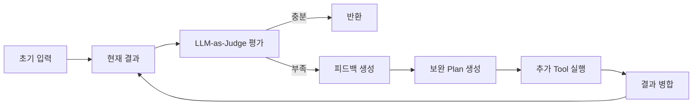
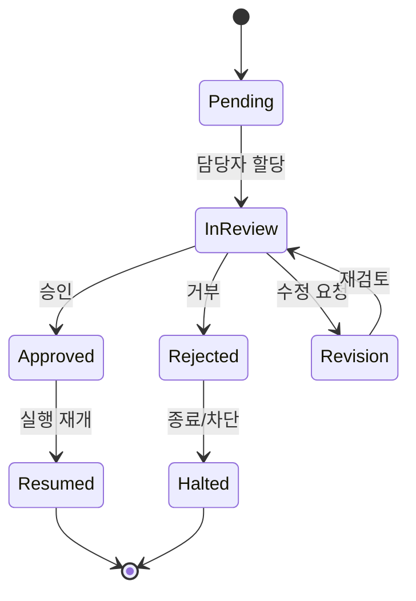

# 05. Observe and Feedback Loop

## 이 챕터에서 배우는 것

- 결과를 평가하고 개선하는 **Observe 단계의 역할**
- 재시도, 재계획, 폴백을 선택하는 **피드백 루프 설계**
- 근거 중심 답변과 안전 정책을 **일관되게 유지**하는 방법
- LangGraph에서 평가 결과로 **라우팅을 구현**하는 패턴

---

## 1. Observe는 실행의 마지막이 아니라 운영의 시작

Observe는 “답변이 나왔는지”가 아니라 **답변이 안전하고 충분한지**를 판단하는 단계입니다.  
이 문서는 **LLM-as-Judge** 프레임워크를 전제로 합니다.
즉, Observe는 “문제 해결”보다 **품질 관리와 리스크 제어**에 더 가까운 단계입니다.
초급자는 이 단계를 “마지막 점검”으로 이해하면 됩니다.
고급자는 이 단계를 **운영 정책의 핵심**으로 다뤄야 합니다.

핵심 아이디어:

- Judge가 **초기 입력 + 현재 결과**를 함께 평가한다
- 부족한 부분만 보완하는 **추가 Plan**을 만든다
- 보완 결과를 **기존 결과와 병합**한다
- 충분하면 종료, 아니면 **Plan-and-Execute Loop**로 다시 진입한다

---

## 2. LLM-as-Judge 기반 피드백 루프 구조

이 섹션은 **평가 → 보완 → 병합 → 재평가**의 반복 구조를 눈으로 이해하기 위한 부분입니다.  
초급자는 “왜 다시 계획을 세우는지”를, 중급 이상은 “어디서 비용과 위험을 제어하는지”를 보는 관점으로 읽으면 됩니다.
이 구조는 실패를 최소화하는 것이 아니라 **실패를 통제**하는 데 초점이 있습니다.
즉, 실패를 무조건 없애는 것이 아니라 **허용 가능한 실패**만 남기는 구조입니다.
이 관점이 있어야 비용과 품질을 동시에 관리할 수 있습니다.



이 구조는 “처음부터 다시 하기”가 아니라, **부족한 부분만 보완**하는 것이 목표입니다.

---

## 3. 평가 기준 설계

평가 기준은 Agent 품질을 좌우합니다.  
기준이 느슨하면 잘못된 답이 통과하고, 기준이 과하면 재시도가 폭증해 비용이 증가합니다.
따라서 기준은 “간단하지만 강력한 룰”로 설계하는 것이 현실적입니다.
평가 기준은 팀 합의를 통해 유지되어야 합니다.
그래야 운영 중에도 기준이 흔들리지 않습니다.

평가 기준은 **복잡하지 않게, 하지만 명확하게** 설계해야 합니다.

### 3-1) 핵심 평가 축

- **정확성**: 질문을 직접 해결했는가
- **근거성**: evidence가 포함되어 있는가
- **정합성**: 답변이 서로 모순되지 않는가
- **안전성**: 정책 위반이 없는가

### 3-2) 출력 형식 기준

출력 형식은 “정답”보다 먼저 정해야 하는 규칙입니다.  
형식이 고정되면 평가/검증/로그가 훨씬 쉬워집니다.

- 요약 + 근거 + 한계 구조를 유지
- 근거가 부족하면 “부족함”을 명시

---

## 4. 피드백 루프 설계 (Judge 결과 기반)

이 단계는 “무조건 재시도”가 아니라 **원인에 맞는 복구 경로를 선택**하는 설계입니다.  
즉, “부족 → 보완 Plan”, “정책 위반 → 중단”처럼 **결정 규칙**을 명확히 해야 합니다.
피드백 루프는 잘못된 답을 줄이는 동시에, 비용과 시간을 통제하는 장치입니다.
루프가 길어질수록 비용이 증가하기 때문에 종료 조건이 필요합니다.
따라서 루프는 **정책 기반으로 제한**되어야 합니다.

Judge가 부족하다고 판단하면 **보완 Plan**을 만든 뒤 실행합니다.

### 언제 무엇을 선택하나

- **보완 Plan**: 근거가 부족하거나 특정 정보가 누락된 경우
- **재시도**: 일시적 실패 또는 출력 형식 문제
- **폴백**: 비용/시간 제약이 큰 경우
- **중단**: 권한/보안 정책 위반

---

## 5. 평가 결과를 LangGraph 라우팅으로 연결

평가 결과는 사람이 보는 리포트가 아니라 **그래프가 이동할 경로**입니다.  
따라서 `verdict`는 라우팅 키로 설계하고, 모든 분기를 포괄해야 합니다.
이 설계가 없다면 그래프는 “다음에 무엇을 해야 하는지”를 알 수 없습니다.
즉, 평가 결과는 **실행 제어 신호**입니다.
이 관점이 없으면 라우팅이 중구난방이 됩니다.

```python
"""
목적: 평가 결과에 따라 다음 경로를 선택한다.
설명: 평가 결과를 문자열로 반환해 라우팅한다.
디자인 패턴: Router
"""

def route_on_eval(state: dict) -> str:
    verdict = state.get("verdict", "retry")
    if verdict == "pass":
        return "end"
    if verdict == "replan":
        return "replan"
    if verdict == "review":
        return "review"
    if verdict == "fallback":
        return "fallback"
    if verdict == "stop":
        return "halt"
    return "retry"
```

---

## 6. Judge + 보완 Plan 예시

아래 예시는 “근거가 부족할 때만 보완 Plan을 만든다”는 정책을 보여줍니다.  
실무에서는 이 부분이 **재시도 비용을 줄이는 핵심 로직**이 됩니다.
핵심은 “필요한 경우에만 보완”하여 루프를 줄이는 것입니다.
이렇게 해야 비용과 지연을 통제할 수 있습니다.
즉, 보완 Plan은 최소한으로 사용하는 것이 이상적입니다.

```python
"""
목적: 결과 품질을 단순 규칙으로 평가한다.
설명: 근거 유무, 길이, 위험 신호를 확인한다.
디자인 패턴: Validator
"""

def judge_and_feedback(state: dict) -> dict:
    question = state.get("request", "")
    current = state.get("answer", "")
    evidence = state.get("evidence", [])

    if not current:
        return {**state, "verdict": "retry"}
    if "비밀번호" in current:
        return {**state, "verdict": "stop"}
    if state.get("need_human_review"):
        return {**state, "verdict": "review", "review_reason": "policy"}
    if not evidence:
        # 부족한 근거를 채우기 위한 보완 Plan 생성
        gap_plan = {"steps": [{"id": 1, "action": "tool_call", "tool": "search_docs", "input": {"query": question}}]}
        return {**state, "verdict": "replan", "gap_plan": gap_plan}
    if len(current) < 30:
        return {**state, "verdict": "fallback"}
    return {**state, "verdict": "pass"}
```

LLM-as-Judge를 실제로 쓰려면 아래처럼 프롬프트를 정의합니다.

```python
"""
목적: LLM-as-Judge로 답변 품질을 평가한다.
설명: verdict만 반환하도록 강제한다.
디자인 패턴: Judge
"""

from textwrap import dedent
from langchain_openai import ChatOpenAI
from langchain_core.prompts import PromptTemplate
from langchain_core.output_parsers import StrOutputParser


_PROMPT = dedent(
    """
    너는 답변 평가 전문가다.
    아래 기준으로 verdict 하나만 반환하라.
    기준:
    - pass: 답변이 충분하고 근거가 있다.
    - replan: 근거가 부족하거나 정보가 누락되었다.
    - retry: 일시적 오류로 보이며 재시도가 필요하다.
    - fallback: 비용/시간상 간단 답변으로 종료해야 한다.
    - stop: 보안/정책 위반이 의심된다.
    출력 형식:
    - verdict만 작성한다.
    질문: {{question}}
    답변: {{answer}}
    근거: {{evidence}}
    """
).strip()
_JUDGE_PROMPT = PromptTemplate.from_template(_PROMPT)


def judge_with_llm(question: str, answer: str, evidence: str) -> str:
    llm = ChatOpenAI(model="gpt-4o-mini", temperature=0)
    return (_JUDGE_PROMPT | llm | StrOutputParser()).invoke(
        {"question": question, "answer": answer, "evidence": evidence}
    )
```

---

## 7. gap_plan 실행 라우팅 예시

gap_plan이 있으면 **보완 실행 노드로 이동**해야 하고,  
그 결과는 다시 Judge로 돌아가야 합니다. 이 흐름이 반복 루프의 본체입니다.
여기서 라우팅이 꼬이면 무한 루프가 발생할 수 있으므로 조건을 명확히 해야 합니다.
즉, 보완 루프에는 **횟수 제한**이나 **종료 조건**이 필요합니다.
이 제한이 있어야 운영에서 비용 폭증을 막을 수 있습니다.

```python
"""
목적: gap_plan이 있으면 보완 실행 노드로 라우팅한다.
설명: judge 결과에 따라 실행 경로를 분기한다.
디자인 패턴: Router
"""

from langgraph.graph import StateGraph, END


def route_on_verdict(state: dict) -> str:
    verdict = state.get("verdict", "retry")
    if verdict == "replan" and state.get("gap_plan"):
        return "gap_execute"
    if verdict == "replan":
        return "replan"
    if verdict == "review":
        return "review"
    if verdict == "pass":
        return "end"
    if verdict == "fallback":
        return "fallback"
    if verdict == "stop":
        return "halt"
    return "retry"


builder = StateGraph(dict)
builder.add_node("judge", judge_and_feedback)
builder.add_node("gap_execute", lambda s: s)  # 실제로는 Plan 실행 노드
builder.add_node("fallback", lambda s: s)
builder.add_node("halt", lambda s: s)
builder.add_node("replan", lambda s: s)
builder.add_node("review", node_request_human_review)

builder.set_entry_point("judge")
builder.add_conditional_edges(
    "judge",
    route_on_verdict,
    {
        "gap_execute": "gap_execute",
        "fallback": "fallback",
        "halt": "halt",
        "review": "review",
        "replan": "replan",
        "retry": "judge",
        "end": END,
    },
)
builder.add_edge("gap_execute", "judge")
builder.add_edge("replan", "judge")
builder.add_edge("review", "halt")
graph = builder.compile()
```

---

## 8. 보완 결과 병합 전략 예시

보완 결과는 기존 결과를 **완전히 대체하지 않고 보강**하는 것이 기본입니다.  
따라서 evidence는 합치고, answer는 최신 결과를 우선하는 구조가 안정적입니다.

```python
"""
목적: 기존 결과와 보완 결과를 병합한다.
설명: evidence는 합치고, answer는 최신 결과를 반영한다.
디자인 패턴: Merge
"""

def merge_with_gap(state: dict, gap_state: dict) -> dict:
    merged_evidence = (state.get("evidence", []) + gap_state.get("evidence", []))
    merged_answer = gap_state.get("answer") or state.get("answer")
    return {**state, "evidence": merged_evidence, "answer": merged_answer}
```

---

## 9. gap_plan 실행 예시(Plan-and-Execute 재사용)

보완 Plan은 새로 만든 것이기 때문에, **기존 Plan-and-Execute 파이프라인을 재사용**해야 합니다.  
이렇게 하면 새로운 로직을 만들지 않고도 보완 실행을 처리할 수 있습니다.

```python
"""
목적: gap_plan을 Plan-and-Execute로 실행한다.
설명: gap_plan을 state에 주입하고 실행 노드로 전달한다.
디자인 패턴: Pipeline
"""

def node_gap_execute(state: dict) -> dict:
    gap_plan = state.get("gap_plan", {})
    # 실제 구현에서는 02장 Plan-and-Execute 실행 노드를 재사용
    return {**state, "plan": gap_plan}
```

---

## 10. 실패 자동 복구/재실행 시나리오

자동 복구는 “무조건 재시도”가 아니라 **실패 유형에 맞는 경로 선택**입니다.  
일시적 실패는 재시도하고, 영구적 실패는 재계획이나 폴백으로 전환해야 합니다.  
이 구분이 없으면 재시도는 비용만 늘리고 품질은 개선되지 않습니다.  
초급자는 분기 기준을 이해하고, 고급자는 실패 분류와 정책을 확장하면 됩니다.  
결국 중요한 것은 “어떤 실패를 어느 단계에서 복구할지”를 명시하는 것입니다.

```python
"""
목적: 실패 유형에 따라 재시도/재계획을 분기한다.
설명: transient는 재시도, permanent는 재계획으로 보낸다.
디자인 패턴: Retry + Escalation
"""

def classify_failure(error: str) -> str:
    if "timeout" in error or "temporarily unavailable" in error:
        return "transient"
    return "permanent"


def node_recover(state: dict) -> dict:
    errors = state.get("errors", [])
    if not errors:
        return state
    failure_type = classify_failure(errors[-1])
    if failure_type == "transient":
        return {**state, "verdict": "retry"}
    return {**state, "verdict": "replan"}
```

---

## 11. 근거 중복 제거(dedupe) 전략

보완 실행을 여러 번 하면 근거가 중복되기 쉽습니다.  
중복을 제거하지 않으면 “근거가 많아 보이는 착시”가 발생합니다.

```python
"""
목적: 근거 중복을 제거한다.
설명: source_id 기준으로 중복을 제거한다.
디자인 패턴: Filter
"""

def dedupe_evidence(evidence: list[dict]) -> list[dict]:
    seen: set[str] = set()
    result: list[dict] = []
    for e in evidence:
        source_id = e.get("source_id", "")
        if source_id and source_id in seen:
            continue
        if source_id:
            seen.add(source_id)
        result.append(e)
    return result
```

---

## 12. Human in the loop 연계

Human in the loop은 **자동화의 한계를 안전하게 보완**하기 위한 장치입니다.  
실무에서는 아래 조건에서 반드시 사람 검토로 전환합니다.

- 권한/보안 민감 요청
- 재시도 횟수가 임계치를 넘은 경우
- 품질 평가가 반복적으로 실패하는 경우

Human-in-the-loop은 “큐에 넣고 끝”이 아니라 **상태 전이와 재개 전략**까지 포함하는 설계입니다.  
즉, 리뷰 요청을 만들고, 사람이 판단하고, 결과를 다시 그래프로 반영하는 전체 파이프라인이 필요합니다.  
초급자는 전체 흐름을 따라가며 핵심 단계만 이해하면 되고, 고급자는 정책과 감사 로그를 보강하면 됩니다.  
이 구조가 없으면 사람 검토가 오히려 운영 병목을 만들 수 있습니다.  
따라서 “요청 생성 → 할당 → 판단 → 반영 → 재개” 흐름을 명확히 설계해야 합니다.

### 12-0) 전체 흐름과 상태 전이 개요

사람 검토는 **상태 머신**으로 생각하면 구조가 단순해집니다.  
승인/거부/수정 요청을 구분하고, 각 결과가 실행 흐름에 어떤 영향을 주는지 정해야 합니다.  
이 상태 전이가 정리되어 있으면 개발자 간 의사소통이 쉬워집니다.  
또한 운영 중 장애가 발생해도 “어디서 멈췄는지”가 명확해집니다.  
결국 상태 전이는 품질과 운영성을 동시에 잡는 핵심입니다.



### 12-1) 리뷰 요청 객체 설계

```python
"""
목적: 사람 검토 요청 구조를 정의한다.
설명: 무엇을 검토해야 하는지 최소 정보만 담는다.
디자인 패턴: Data Transfer Object
"""

from pydantic import BaseModel, Field


class ReviewRequest(BaseModel):
    request_id: str = Field(description="요청 식별자")
    question: str = Field(description="사용자 질문 원문")
    current_answer: str = Field(description="현재 생성된 답변")
    evidence: list[dict] = Field(default_factory=list, description="근거 목록")
    reason: str = Field(description="사람 검토가 필요한 이유")
```

---

### 12-2) 리뷰 큐로 전달하는 예시

```python
"""
목적: 사람 검토 요청을 큐에 적재한다.
설명: 실무에서는 메시지 큐/티켓 시스템을 사용한다.
디자인 패턴: Queue Publisher
"""

def enqueue_review(req: ReviewRequest) -> None:
    # 실제 구현에서는 Kafka/SQS/DB/티켓 시스템에 저장
    print(f"[REVIEW] {req.request_id}: {req.reason}")


def node_request_human_review(state: dict) -> dict:
    req = ReviewRequest(
        request_id=state.get("request_id", "unknown"),
        question=state.get("request", ""),
        current_answer=state.get("answer", ""),
        evidence=state.get("evidence", []),
        reason=state.get("review_reason", "policy"),
    )
    enqueue_review(req)
    return {**state, "verdict": "review"}
```

---

### 12-3) LangGraph 라우팅에 연결하기

리뷰 요청을 보냈다면 더 이상 자동으로 진행하지 않고 **대기/종료 경로**로 빠져야 합니다.  
자동화와 사람 검토가 **경합하지 않게** 만드는 것이 핵심입니다.

```python
"""
목적: 리뷰 요청을 보낸 후 종료 또는 대기 상태로 이동한다.
설명: verdict=review를 종료 경로로 분기한다.
디자인 패턴: Router
"""

def route_with_review(state: dict) -> str:
    verdict = state.get("verdict")
    if verdict == "review":
        return "halt"
    return "continue"
```

---

### 12-4) 리뷰 응답 반영 패턴

리뷰 결과는 **상태에 기록**되어야 이후 감사/품질 개선에 활용됩니다.  
승인/거부 모두 남기고, 거부 시에는 사람이 제공한 피드백을 반영합니다.

```python
"""
목적: 사람 검토 결과를 상태에 반영한다.
설명: 승인/거부 결과에 따라 답변을 갱신한다.
디자인 패턴: Workflow
"""

def apply_review_result(state: dict, approved: bool, feedback: str) -> dict:
    if approved:
        return {**state, "answer": state.get("answer", ""), "review_result": "approved"}
    return {**state, "answer": feedback, "review_result": "rejected"}
```

---

### 12-5) 리뷰 티켓 저장/조회와 상태 갱신 예시

사람 검토를 “티켓”으로 관리하면 운영이 훨씬 안정됩니다.  
티켓에는 상태, 담당자, 결정 내용이 들어가야 이후 재현과 감사가 가능합니다.  
초급자는 구조만 이해하고, 고급자는 실제 저장소/권한 모델을 붙이면 됩니다.  
핵심은 “요청과 결과가 모두 기록된다”는 점입니다.  
이 기록이 없으면 운영 품질을 측정할 수 없습니다.

```python
"""
목적: 사람 검토를 티켓으로 저장하고 상태를 관리한다.
설명: pending → in_review → approved/rejected 흐름을 가정한다.
디자인 패턴: Ticket + Repository
"""

from datetime import datetime
from uuid import uuid4
from pydantic import BaseModel, Field


class ReviewTicket(BaseModel):
    ticket_id: str = Field(description="티켓 ID")
    request_id: str = Field(description="요청 ID")
    status: str = Field(description="pending/in_review/approved/rejected/revision")
    assignee: str | None = Field(default=None, description="담당자")
    payload: dict = Field(description="검토 대상 데이터")
    decision: dict | None = Field(default=None, description="검토 결과")
    created_at: str = Field(description="생성 시각")
    updated_at: str = Field(description="갱신 시각")


def create_review_ticket(state: dict) -> ReviewTicket:
    now = datetime.utcnow().isoformat()
    return ReviewTicket(
        ticket_id=str(uuid4()),
        request_id=state.get("request_id", "unknown"),
        status="pending",
        payload={
            "question": state.get("request", ""),
            "answer": state.get("answer", ""),
            "evidence": state.get("evidence", []),
        },
        created_at=now,
        updated_at=now,
    )


def save_ticket(ticket: ReviewTicket) -> None:
    # 실제 구현에서는 DB/티켓 시스템에 저장
    print(f"[TICKET:SAVE] {ticket.ticket_id}")


def update_ticket_status(ticket: ReviewTicket, status: str, decision: dict | None = None) -> ReviewTicket:
    return ticket.copy(update={"status": status, "decision": decision, "updated_at": datetime.utcnow().isoformat()})
```

---

### 12-6) 사람 판단 결과 반영과 실행 재개 예시

사람 판단은 “승인/거부”만 있는 것이 아니라 **수정 요청/재계획**도 포함됩니다.  
따라서 결과를 상태에 반영하는 로직을 명확히 해두어야 합니다.  
초급자는 분기만 이해해도 충분하고, 고급자는 정책과 감사 로그를 추가하면 됩니다.  
이 분기가 없으면 사람 판단이 실제 실행에 반영되지 않습니다.  
즉, “사람의 판단이 그래프를 움직이는 규칙”을 코드로 고정해야 합니다.

```python
"""
목적: 리뷰 결과를 상태에 반영하고 재개 경로를 결정한다.
설명: approve/reject/replan/override 액션을 지원한다.
디자인 패턴: Decision + Router
"""

from typing import Literal
from pydantic import BaseModel, Field


class ReviewDecision(BaseModel):
    action: Literal["approve", "reject", "replan", "override"]
    note: str = Field(default="", description="검토 메모")
    override_answer: str | None = Field(default=None, description="사람이 제시한 답변")
    extra_plan: dict | None = Field(default=None, description="추가 실행 계획")


def apply_decision(state: dict, decision: ReviewDecision) -> dict:
    if decision.action == "approve":
        return {**state, "verdict": "pass", "review_result": "approved"}
    if decision.action == "reject":
        return {**state, "verdict": "stop", "review_result": "rejected", "review_note": decision.note}
    if decision.action == "override":
        return {
            **state,
            "verdict": "pass",
            "review_result": "override",
            "answer": decision.override_answer or state.get("answer", ""),
        }
    if decision.action == "replan":
        return {
            **state,
            "verdict": "replan",
            "gap_plan": decision.extra_plan or {},
            "review_result": "replan",
        }
    return state
```

---

### 12-7) 리뷰 SLA/타임아웃 처리 예시

사람 검토는 시간이 걸리므로 **SLA/타임아웃 정책**이 필요합니다.  
대기 시간이 길어질수록 사용자 경험과 운영 비용이 동시에 악화됩니다.  
초급자는 타임아웃이 왜 필요한지 이해하고, 고급자는 정책을 세분화하면 됩니다.  
타임아웃이 발생하면 폴백 답변을 내거나, 일정 기준에서 자동 종료해야 합니다.  
이 정책이 없으면 “무한 대기”가 발생할 수 있습니다.

```python
"""
목적: 리뷰 대기 시간이 초과되면 폴백 또는 종료로 전환한다.
설명: SLA 기준을 넘으면 verdict를 fallback/stop으로 변경한다.
디자인 패턴: Timeout + Fallback
"""

from datetime import datetime, timedelta


def is_review_timeout(created_at: str, limit_minutes: int = 30) -> bool:
    created = datetime.fromisoformat(created_at)
    return datetime.utcnow() - created > timedelta(minutes=limit_minutes)


def apply_review_timeout(state: dict, ticket: ReviewTicket) -> dict:
    if is_review_timeout(ticket.created_at):
        return {**state, "verdict": "fallback", "review_result": "timeout"}
    return state
```

---

## 13. 관측성과 기록

Observe는 성능보다 **품질 관리**가 목표이므로, 로그가 곧 품질 지표입니다.  
이 로그를 기준으로 재시도 정책과 평가 기준을 조정합니다.

Observe 단계는 **운영 품질의 핵심 지표**입니다.

반드시 남겨야 하는 로그:

- 평가 점수 또는 verdict
- 재시도 횟수
- 중단 사유
- 폴백 적용 여부

이 로그가 없으면 개선이 불가능합니다.

---

## 14. 실무 체크리스트

- 평가 기준이 단순하고 명확한가?
- verdict가 라우팅에 연결되는가?
- 재시도/재계획/폴백 조건이 구분되는가?
- 보안 위반은 즉시 중단되는가?
- Observe 로그가 누락되지 않는가?
