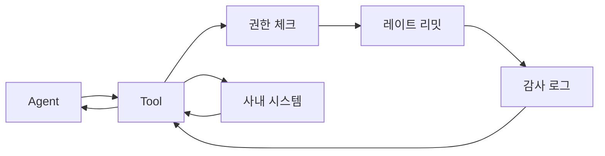
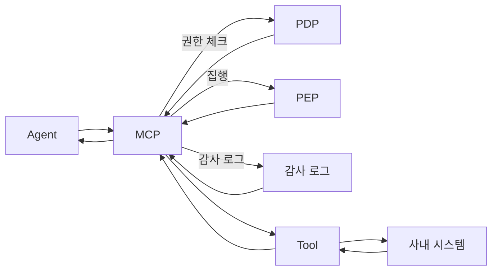

# 03. 좋은 Tool vs 나쁜 Tool

## 이 챕터에서 배우는 것

- 실무 기준으로 Tool 품질을 평가하는 방법
- Tool과 MCP가 **뒤섞이는 위험**을 구분하는 법
- 개선 방향을 **구체적 체크리스트**로 정리하는 법

이 문서는 **초보자부터 고급자까지** 이어지는 튜토리얼입니다.  
처음에는 “무엇이 나쁜 설계인지”를 구체 사례로 확인하고, 이후 리뷰 기준으로 확장합니다.

---

## 1. 실무 기준 비교 표

| 구분 | 좋은 Tool | 나쁜 Tool |
|---|---|---|
| 입력 | 스키마 고정 + 필수/선택 명확 | 자유 텍스트 입력 |
| 책임 | 단일 책임, 실행만 담당 | 인증/권한/실행 혼합 |
| 출력 | 고정 구조 + 표준 에러 | 성공/실패 형식이 다름 |
| 부작용 | 읽기/쓰기 구분, 멱등 키 사용 | 부작용 숨김 |
| 운영 | 타임아웃/재시도 기준 명시 | 예외만 던짐 |
| 관측 | trace_id, actor_id 포함 | 로그 누락 |

---

## 2. 나쁜 Tool 예시

```python
"""
목적: 나쁜 Tool 예시를 보여준다.
설명: 입력/출력 불명확, 책임 혼합, 보안/운영 정책 누락.
디자인 패턴: 안티 패턴
"""

def bad_tool(text: str, user_role: str, token: str):
    # 자연어 입력을 그대로 받아 실행을 분기(입력 스키마 없음)
    if "미결제" in text:
        # 권한 체크를 Tool 내부에서 수행(잘못된 책임)
        if user_role != "admin":
            return "권한 없음"

        # 조회 범위 제한 없음(과도한 데이터 반환 가능)
        data = query_erp_sql(f"SELECT * FROM billing WHERE q='{text}'")
        return data  # 리스트/딕셔너리 혼합 반환

    if "결재" in text:
        # 멱등 키 없음(중복 생성 위험)
        draft_id = create_approval_draft(text, token)
        return draft_id  # 문자열 반환

    # 에러 코드 없이 예외 문자열 반환
    return "알 수 없는 요청"
```

- 문제점
  - 입력이 자연어라 **규칙을 검증할 수 없다**.
  - 권한 집행/토큰 처리까지 Tool이 수행해 **책임이 뒤섞인다**.
  - 조회 범위/건수 제한이 없어 **데이터 과다 노출** 위험이 있다.
  - 멱등 키가 없어 **중복 생성**이 발생할 수 있다.
  - 출력 타입이 매번 달라 **테스트와 모니터링이 불가능**하다.
  - 에러 코드가 없어 **재시도/폴백 정책을 적용하기 어렵다**.

문제점 표

| 항목 | 문제점 | 실무 영향 |
|---|---|---|
| 입력 | 자연어 입력만 사용 | 검증 불가, 오류 증가 |
| 책임 | 권한/토큰 처리 혼합 | 보안 정책 불일치 |
| 범위 | 조회 제한 없음 | 과다 데이터 노출 |
| 멱등성 | 멱등 키 미적용 | 중복 생성/결제 위험 |
| 출력 | 타입 혼합 | 테스트/모니터링 어려움 |
| 에러 | 코드 부재 | 재시도/폴백 판단 불가 |

---

## 3. 좋은 Tool 예시

아래 예시는 같은 업무를 **읽기/쓰기 Tool로 분리**하고, 스키마와 에러를 고정한 구조입니다.  
권한/레이트 리밋/감사는 MCP가 처리하고, Tool은 **실행만 담당**합니다.

```python
"""
목적: 실무형 Tool 예시를 제공한다.
설명: 입력/출력/에러 스키마를 고정하고 단일 책임을 유지한다.
디자인 패턴: 커맨드
"""

from pydantic import BaseModel, Field


class ErrorInfo(BaseModel):
    """표준 에러 정보."""

    code: str = Field(description="에러 코드")
    message: str = Field(description="사용자 메시지")
    retryable: bool = Field(description="재시도 가능 여부")


class BillingQueryArgs(BaseModel):
    """ERP 미결제 내역 조회 입력."""

    customer_id: str = Field(description="고객 ID")
    date_from: str = Field(description="시작일(YYYY-MM-DD)")
    date_to: str = Field(description="종료일(YYYY-MM-DD)")
    top_k: int = Field(default=50, description="최대 조회 건수")
    cursor: str | None = Field(default=None, description="페이지 커서")


class BillingQueryResult(BaseModel):
    """ERP 미결제 내역 조회 결과."""

    items: list[dict]
    count: int
    next_cursor: str | None = None
    error: ErrorInfo | None = None


def erp_billing_query_tool(args: BillingQueryArgs) -> dict:
    """읽기 전용 조회 Tool."""

    items = [
        {"invoice_id": "INV-001", "amount": 120000, "currency": "KRW"},
        {"invoice_id": "INV-002", "amount": 54000, "currency": "KRW"},
    ]
    return BillingQueryResult(items=items, count=len(items)).model_dump()


class ApprovalArgs(BaseModel):
    """결재 승인 입력."""

    draft_id: str = Field(description="결재 초안 ID")
    idempotency_key: str = Field(description="중복 실행 방지 키")


class ApprovalResult(BaseModel):
    """결재 승인 결과."""

    status: str
    draft_id: str
    error: ErrorInfo | None = None


def approve_tool(args: ApprovalArgs) -> dict:
    """쓰기 Tool(멱등 키 필수)."""

    return ApprovalResult(status="approved", draft_id=args.draft_id).model_dump()
```

개선 포인트

- 입력 스키마가 고정되어 **검증과 자동 문서화**가 가능하다.
- 조회/쓰기를 분리해 **단일 책임**을 지킨다.
- 멱등 키로 **중복 실행을 방지**한다.
- 표준 에러 구조로 **재시도/폴백 정책을 적용**할 수 있다.
- **권한 집행은 MCP/정책 엔진**에서 일관되게 처리한다.

개선 포인트 표

| 항목 | 개선 포인트 | 실무 효과 |
|---|---|---|
| 입력 | 스키마 고정 | 검증/자동 문서화 |
| 책임 | 읽기/쓰기 분리 | 단일 책임 유지 |
| 멱등성 | 멱등 키 적용 | 중복 실행 방지 |
| 에러 | 표준 에러 구조 | 재시도/폴백 정책 적용 |
| 보안 | 권한 집행 분리 | 정책 일관성 확보 |

---

## 4. Tool과 MCP가 섞이는 안티 패턴

다음은 실무에서 자주 발생하는 문제입니다.

- Tool 내부에서 **권한 판단/집행**을 수행한다.
- Tool이 **호출 제한/동시성 제어**까지 처리한다.
- Tool이 **감사 로그 정책**을 자체적으로 정한다.

이런 책임은 MCP에서 일관되게 처리해야 합니다.

## 4-1) 실패/재시도 기준

실무에서는 “무조건 재시도”가 아니라 **실패 유형별 정책**을 둡니다.

| 실패 유형 | 예시 | 재시도 | 책임 레이어 |
|---|---|---|---|
| 일시적 실패 | 네트워크 타임아웃, 일시적 레이트 리밋 | 가능 | MCP(표준 정책) |
| 영구적 실패 | 권한 거부, 잘못된 입력 | 불가 | Agent(즉시 사용자 응답) |
| 리소스 없음 | 없는 고객/문서 | 불가 | Tool(정상 에러 반환) |
| 품질 실패 | 결과가 부족/불완전 | 조건부 | Agent(요약/재질의) |
| 쓰기 실패 | 중복 요청, 충돌 | 조건부 | MCP+Tool(멱등 키 필수) |

핵심 원칙

- **읽기 전용**은 제한적으로 재시도 가능하다.
- **쓰기 작업**은 멱등 키가 있을 때만 재시도한다.
- 재시도 대상이 아닌 실패는 **즉시 사용자 메시지**로 변환한다.

---

## 5. 실무 예시: 개선 리뷰

**상황**

- 프로젝트에서 “고객 정보 조회 Tool”이 자연어 입력을 받는다.
- 출력이 리스트/문자열/에러가 혼합되어 있다.

**개선 방향**

1. 입력 스키마를 Pydantic으로 고정한다.
2. 출력 형식을 `{items, count, error}`로 통일한다.
3. 권한 판단은 MCP/정책 엔진으로 이동한다.
4. 조회 범위 제한을 추가해 과도한 요청을 막는다.

---

## 6. 체크리스트

- 입력 스키마가 명확하고 검증 가능한가?
- Tool이 단일 책임(실행만)을 지키는가?
- 출력/에러 형식이 표준화되어 있는가?
- 권한/감사/제한 정책이 MCP에 위치하는가?
- 멱등 키와 타임아웃 정책이 문서화되어 있는가?

---

## 7. Tool/MCP 분리 전후 비교

### 7-1) 분리 전



문제점

- Tool이 **권한/제한/감사**를 모두 처리해 책임이 섞인다.
- 재시도 기준이 Tool마다 달라 **운영 정책이 분산**된다.

### 7-2) 분리 후



분리 전/후 장단점 정리

| 구분 | 장점 | 단점 |
|---|---|---|
| 분리 전 | 초기 구현이 단순하고 빠르다 | 정책/감사/제한이 Tool마다 달라져 운영이 분산된다 |
| 분리 전 | 인프라 구성 요소가 적다 | 보안 기준이 일관되지 않아 감사 대응이 어렵다 |
| 분리 전 | 단일 흐름이라 이해가 쉬워 보인다 | Tool이 늘수록 중복 로직과 유지보수 비용이 폭증한다 |
| 분리 전 | 작은 프로토타입에는 적합 | 장애 원인 추적과 격리가 어렵다 |
| 분리 후 | 권한/제한/감사가 중앙화되어 일관된다 | 초기 설계/구성 비용이 증가한다 |
| 분리 후 | 재시도/폴백 정책이 표준화된다 | MCP 경유로 인한 호출 경로가 길어진다 |
| 분리 후 | Tool 추가 시 운영 기준이 유지된다 | MCP 장애 시 전체 영향 범위가 커질 수 있다 |
| 분리 후 | 관측/로그 기준이 통일되어 대응이 빠르다 | 초기에는 복잡하게 느껴질 수 있다 |

정리

- 분리 전은 **빠른 시작**에는 유리하지만, Tool이 늘어날수록 운영 비용이 급격히 증가한다.  
- 분리 후는 **초기 비용**이 있지만, SI 실무처럼 규모가 커질수록 안정성과 확장성이 커진다.

개선점

- Tool은 **실행만 담당**하고 MCP가 **통제/관측**을 일관되게 수행한다.
- 재시도 기준이 MCP 정책으로 통일되어 **운영이 단순**해진다.
