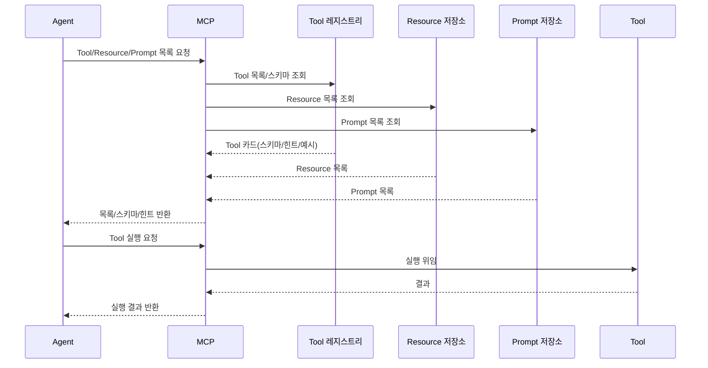
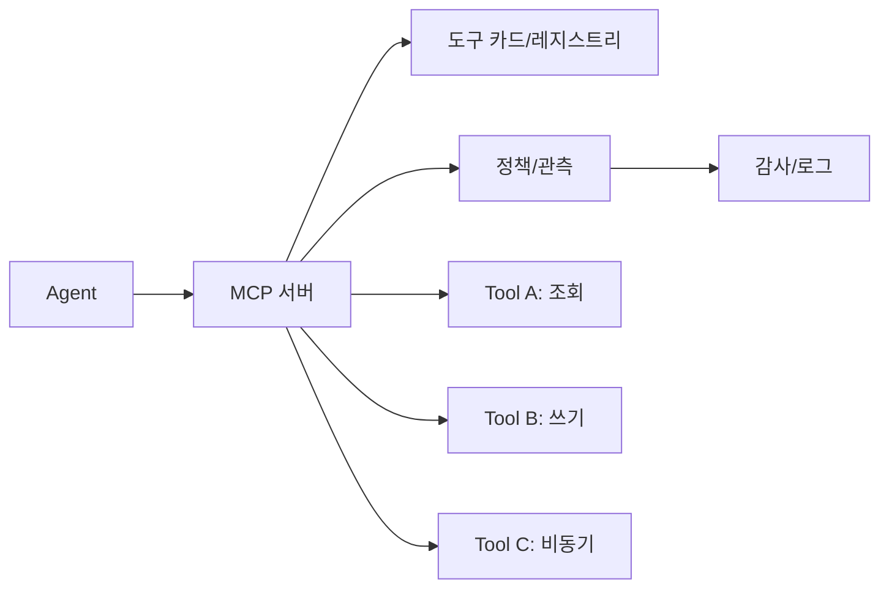
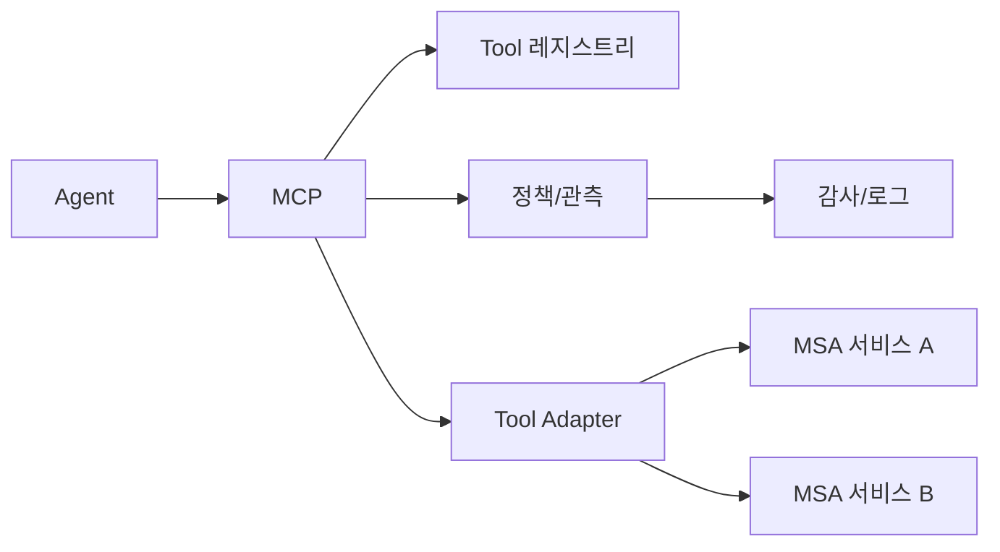

# 01. MCP 개요와 MCP를 Tool로 보기

## 이 챕터에서 배우는 것

- MCP의 역할을 **Tool/Resource/Prompt**로 구분하기
- MCP를 **Tool 번들**로 이해하는 관점 정리하기
- MCP와 MSA의 **문제 영역**을 구분하고 함께 쓰는 방법 이해하기
- Agent와의 통신 흐름을 **실무 관점**으로 정리하기
- stdio 기반 MCP 서버를 **직접 만들어 실행**하기
- 일반 백엔드 API와 **무엇이 다른지** 이해하기

---

## 1. 용어 정리

이 문서의 용어는 이후 모든 흐름의 기준이 됩니다. 용어를 통일하면 Tool 설계와 MCP 운영 사이의 책임 경계가 흐트러지지 않습니다.

- **Tool**: 실행 가능한 함수 단위
- **Resource**: 읽기/조회 가능한 데이터
- **Prompt**: 재사용 가능한 지시문 템플릿
- **Tool 카드**: Tool 설명 + 스키마 + 힌트 + 예시를 묶은 정보 단위

---

## 2. MCP 정의

MCP(Model Context Protocol)는 **LLM이 사용할 도구와 컨텍스트를 표준 방식으로 제공하는 규격**입니다.

- Tool 제공
- Resource 제공(파일/DB/문서 등)
- Prompt 템플릿 제공

즉, MCP는 **LLM이 사용할 “작업 환경”을 표준화**합니다.

---

## 3. 구성 요소 정리

MCP는 세 가지 구성 요소를 통해 LLM에게 “실행과 컨텍스트”를 제공합니다. 이 구성을 명확히 구분해야 확장 시 혼란이 줄어듭니다.

- **Tools**: 실행 가능한 함수 목록
- **Resources**: 읽기/조회 가능한 데이터
- **Prompts**: 재사용 가능한 프롬프트 템플릿

Tool은 **실행**, Resource는 **데이터**, Prompt는 **지시문** 역할을 담당합니다.

---

## 4. MCP를 Tool로 보는 이유

MCP는 **여러 Tool을 한 번에 제공하는 서버**입니다. Agent 관점에서는 **하나의 Tool 번들**처럼 보입니다.

- Tool 목록 제공
- 입력/출력 스키마 제공
- 실행 결과 반환

즉, Agent는 MCP 하나만 연결해도 **여러 Tool을 얻는 효과**가 있습니다.

---

## 5. Tool 설계와 MCP의 연결

Tool 설계에서 정의한 내용이 **MCP로 올라오는 구조**입니다.

- Tool의 **스키마/힌트/예시**는 MCP 등록 메타데이터로 올라간다.
- MCP는 Tool을 **도구 카드**로 묶어서 Agent에게 제공한다.
- Agent는 도구 카드 기준으로 Tool을 선택/호출한다.

이 연결이 느슨하면 LLM은 잘못된 Tool을 고르거나 잘못된 입력을 만들게 됩니다. 그래서 Tool 설계 단계에서 스키마/힌트/예시를 고정해 MCP로 올리는 것이 중요합니다.

---

## 6. Agent ↔ MCP 통신 흐름

아래 흐름은 Agent가 MCP를 통해 어떤 정보를 받고 실행까지 연결하는지를 보여줍니다. 스키마와 힌트가 함께 전달되기 때문에 LLM은 안전하게 Tool을 선택할 수 있습니다.



---

## 7. MCP를 Tool 번들로 볼 때의 구조

아래 구조는 MCP가 “도구 번들”로 동작할 때의 최소 흐름을 보여줍니다. 정책/관측 레이어가 MCP에 붙어있기 때문에 Tool 수가 늘어도 통제가 유지됩니다.



---

## 8. MCP vs 일반 백엔드 API(초보자용)

일반 백엔드 API는 “요청 → 응답”이 전부입니다. MCP는 **LLM이 이해할 수 있는 도구 정보**를 먼저 제공해야 합니다.

- **백엔드 API**: URL, 요청/응답 스펙만 맞으면 된다.
- **MCP**: Tool 목록/스키마/힌트까지 제공해야 LLM이 안전하게 호출한다.

즉, MCP는 **단순 HTTP 서버가 아니라 LLM 친화형 서버**입니다.

---

## 9. MCP vs 일반 백엔드 API(고급자용)

고급 관점에서는 MCP가 **“도구 메타데이터 레지스트리 + 실행 게이트웨이”**라는 점이 중요합니다.

- API 서버는 비즈니스 로직을 직접 수행한다.
- MCP는 **도구 카드(스키마/힌트/예시)**를 표준화해 제공한다.
- 인증/권한/레이트 리밋을 **도구 전체에 일관되게 적용**한다.

이 차이 때문에 MCP는 **도구 수가 늘어날수록 가치가 커집니다**.

---

## 10. MCP 서버 만들기 튜토리얼(초보자 → 고급자)

### 10-1) 목표

간단한 MCP 서버를 만들고 stdio로 실행합니다. Tool 2개를 등록해 실제 호출 흐름을 갖춥니다.

### 10-2) 파일 준비

`math_server.py` 파일을 만든다고 가정합니다.

### 10-3) 코드 작성(기본)

```python
"""
목적: stdio 기반 MCP 서버를 구현한다.
설명: add/multiply Tool을 등록한다.
디자인 패턴: 커맨드
"""

from mcp.server.fastmcp import FastMCP

mcp = FastMCP("Math")


@mcp.tool()
def add(a: int, b: int) -> int:
    """두 수를 더한다."""

    return a + b


@mcp.tool()
def multiply(a: int, b: int) -> int:
    """두 수를 곱한다."""

    return a * b


if __name__ == "__main__":
    mcp.run(transport="stdio")
```

### 10-4) 실행 (uv 기준)

```bash
uv run --with mcp math_server.py
```

### 호출 예제

서버가 떠 있다는 가정에서, MCP 클라이언트로 Tool 목록과 실행을 확인하는 최소 예시입니다.

```python
"""
목적: MCP 서버에 연결해 Tool 목록과 실행을 확인한다.
설명: ClientSession과 load_mcp_tools를 사용한다.
디자인 패턴: 어댑터
"""

from mcp import ClientSession, StdioServerParameters
from mcp.client.stdio import stdio_client
from langchain_mcp_adapters.tools import load_mcp_tools

server_params = StdioServerParameters(
    command="python",
    args=["/path/to/math_server.py"],
)

async def run():
    async with stdio_client(server_params) as (read, write):
        async with ClientSession(read, write) as session:
            await session.initialize()
            tools = await load_mcp_tools(session)
            # Tool 목록 확인
            for t in tools:
                print(t.name, t.description)
            # 첫 번째 Tool 호출(예: add)
            result = await tools[0].ainvoke({"a": 3, "b": 5})
            print("결과:", result)
```

### 10-5) 확장 포인트

- **도구 카드 품질**: Tool docstring/힌트를 개선한다.
- **권한/감사**: MCP 앞단에 인증/감사 정책을 붙인다.
- **에러 표준화**: 에러 구조를 통일해 재시도 정책을 쉽게 만든다.

---

## 11. MCP vs MSA

MCP와 MSA는 서로 대체 관계가 아니라 **다른 문제를 해결**합니다. 아래 표는 두 개념의 차이를 명확히 비교하기 위한 최소 기준입니다.

| 항목 | MCP | MSA |
|---|---|---|
| 목적 | LLM 도구/컨텍스트 표준화 | 서비스 분리/확장성 |
| 주 대상 | Agent/Tool | 비즈니스 서비스 |
| 핵심 가치 | 일관된 Tool 인터페이스 | 팀 독립성, 배포 유연성 |
| 실패 영향 | Agent 호출 품질 | 서비스 장애/성능 |

---

## 12. 함께 쓰는 구조

실무에서는 MCP가 LLM 관점의 표준 레이어가 되고, 실제 실행은 MSA 서비스가 담당하는 구조가 흔합니다. 이 분리가 있어야 확장과 운영이 안정적입니다.



---

## 13. 실무 판단 기준

도입 판단은 “우리 조직의 문제”가 무엇인지에 달려 있습니다. 아래 기준은 실제 프로젝트에서 의사결정을 빠르게 내리기 위한 최소 기준입니다.

- Tool 인터페이스가 표준화되어야 한다 → **MCP 우선**
- 서비스 조직이 분리되어야 한다 → **MSA 우선**
- 둘 다 필요하면 **MCP를 상위 레이어**로 둔다

---

## 14. 도입 시 체크포인트

도입 전에는 연결 방식과 장애 대응까지 미리 정해두는 것이 안전합니다.

- MCP 주소/인증 방식이 정의되어 있는가?
- Tool 목록/스키마 제공 방식이 확정되었는가?
- Agent에서 MCP 호출 책임이 명확한가?
- MCP 장애 시 **대체 경로**가 정의되어 있는가?

---

## 15. 체크리스트

아래 항목은 MCP 도입 여부와 준비 상태를 간단히 점검하기 위한 기준입니다.

- Tool/Resource/Prompt 목록이 문서화되었는가?
- 스키마/힌트가 Agent가 이해할 수준으로 제공되는가?
- MCP/MSA 역할 경계가 문서화되었는가?
- 두 구조를 함께 사용할 때 책임 흐름이 명확한가?
