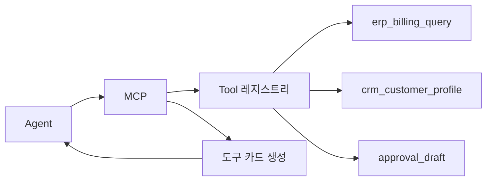

# 04. MCP 내부의 여러 Tool 관리

## 이 챕터에서 배우는 것

- MCP가 **Tool 레지스트리**를 관리하는 방식
- Tool 등록 시 필요한 **메타데이터와 힌트 구조**
- Agent가 도구를 선택할 수 있게 **도구 카드**를 제공하는 방법
- DB 조회 Tool의 **동적 힌트 갱신** 운영 기준
- Agent 프롬프트에 도구 카드를 **주입하는 방식**
- MCP 서버의 **정책 필터/마스킹 구현**

이 문서는 `01_엠씨피_개요`와 `02_엘엘엠_엠씨피_연동`에서 다룬 내용을 **고급 구현 전략**으로 확장합니다.  
앞에서 MCP의 역할과 연동 방법을 이해했다면, 이제는 **내부 Tool 레지스트리/도구 카드 품질/운영 정책**을 설계해야 합니다.  
초급자는 “도구 카드가 왜 필요한지”를, 중급 이상은 “운영 안정성과 힌트 품질 관리”를 중점으로 읽으면 좋습니다.

---

## 1. Tool 레지스트리 개념

MCP는 내부에 Tool 목록(레지스트리)을 가지고 있고, Agent가 요청하면 **스키마와 힌트를 포함한 도구 카드**를 제공합니다.
레지스트리는 “도구 카탈로그” 역할을 하며, Agent가 어떤 Tool을 선택할 수 있는지의 기준이 됩니다.

이 부분은 `02_엘엘엠_엠씨피_연동`의 “Tool 목록 로드” 흐름이 **어떤 정보를 기반으로 작동하는지**를 설명합니다.  
즉, LLM이 올바른 Tool을 선택하려면 레지스트리에 **정확한 도구 카드**가 있어야 합니다.



---

## 2. Tool 목록 제공 흐름

Tool 목록 제공은 Agent가 **올바른 Tool을 고를 수 있도록** 정보를 제공하는 과정입니다. 도구 카드가 없으면 LLM은 호출 규칙을 알 수 없습니다.

1) Agent가 MCP에 Tool 목록 요청
2) MCP가 도구 카드(설명/스키마/힌트/예시)를 반환
3) Agent가 특정 Tool을 선택해 호출

이 구조가 있어야 **Agent가 안전하게 도구를 선택**합니다.

- Tool 목록이 부정확하면 **LLM 선택 품질**이 급격히 떨어집니다.
- 따라서 레지스트리는 “등록 여부”가 아니라 **도구 카드 품질**까지 관리해야 합니다.

---

## 2-1. Agent 연동 시 정보 제공의 두 축

MCP가 Agent와 연결되면 “정보 제공”은 **두 곳에서 동시에 설계**되어야 합니다.  
한쪽만 잘 설계해도 실제 품질은 올라가지 않습니다.

**Agent 구현에서 해야 하는 것**

- 사용자 요청/권한/목표에 맞춰 **필요한 수준의 Tool 정보만** 요청한다.
- 수신한 Tool 카드를 **프롬프트 컨텍스트**로 정리해 LLM에 전달한다.
- Tool 선택 실패 시 **대체 Tool 탐색**이나 **요약 응답**으로 폴백한다.
- 비용/지연을 줄이기 위해 **캐시 범위**를 설계한다(세션/테넌트/사용자 단위).

**MCP 서버 구현에서 해야 하는 것**

- 정책/권한에 따라 **도구 카드 필드 노출을 제어**한다(예: 스키마/힌트 일부 마스킹).
- Tool 카드에 **실행 규칙/힌트/예시**를 포함해 LLM이 안정적으로 입력하도록 돕는다.
- 동적 힌트(현재 값/상태 값)를 **정기 갱신**해 선택 품질을 유지한다.
- 버전/폐기 정책을 명확히 하고 **구버전 도구의 사용률을 모니터링**한다.

즉, **Agent는 “어떤 정보를 어떻게 요청/사용할지”를 설계**하고,  
**MCP는 “어떤 정보를 어떤 조건으로 노출할지”를 설계**합니다.

Agent 측 정보 요청 예시(개념)

```python
"""
목적: Agent가 MCP에서 필요한 범위의 도구 카드를 요청하는 예시를 보여준다.
설명: 요청 범위를 좁혀 토큰 비용을 줄이고 선택 품질을 높인다.
디자인 패턴: Query Builder
"""

def build_tool_query(user_role: str, scope: str) -> dict:
    return {"role": user_role, "scope": scope, "include_hints": True}


def request_tool_cards(mcp_client, user_role: str) -> list[dict]:
    query = build_tool_query(user_role=user_role, scope="billing")
    return mcp_client.list_tools(query)
```

Agent 측 프롬프트 구성 예시(LangChain 기반)

```python
"""
목적: MCP에서 받은 도구 카드를 LLM 프롬프트에 주입하는 예시를 보여준다.
설명: 도구 카드 요약을 프롬프트 컨텍스트로 만들어 Tool 선택 품질을 높인다.
디자인 패턴: Prompt Builder
"""

from textwrap import dedent
from langchain_openai import ChatOpenAI
from langchain_core.prompts import PromptTemplate
from langchain_core.output_parsers import StrOutputParser


_PROMPT = dedent(
    """
    너는 Tool 선택 전문가다.
    아래 도구 카드 요약을 참고해, 사용자 질문에 가장 적합한 Tool 이름을 1개만 반환하라.
    규칙:
    - 도구 카드에 없는 Tool은 선택하지 않는다.
    - 반드시 Tool 이름만 반환한다.
    - 애매하면 "need_more_info"를 반환한다.

    사용자 질문:
    {question}

    도구 카드 요약:
    {tool_cards}
    """
).strip()
_SELECT_TOOL_PROMPT = PromptTemplate.from_template(_PROMPT)


def build_tool_card_summary(cards: list[dict]) -> str:
    lines = []
    for c in cards:
        lines.append(f"- {c['name']}: {c.get('description', '')}")
    return "\n".join(lines)


async def select_tool_name(question: str, cards: list[dict]) -> str:
    llm = ChatOpenAI(model="gpt-4o-mini", temperature=0)
    summary = build_tool_card_summary(cards)
    return await (_SELECT_TOOL_PROMPT | llm | StrOutputParser()).ainvoke(
        {"question": question, "tool_cards": summary}
    )
```

---

## 3. Tool 등록 메타데이터

Tool을 MCP에 등록할 때는 **실행 정보 + 운영 정책 + 힌트**가 함께 있어야 합니다.
이 구조가 없으면 Tool이 늘어날수록 운영 규칙이 무너지고 품질이 떨어집니다.

이 섹션은 `01_엠씨피_개요`에서 정의한 “도구 카드” 개념을 **실제 필드 구조**로 확장한 것입니다.

필수 항목 예시

- `name`, `version`, `description`
- `read_only`, `idempotency_required`
- `input_schema`, `output_schema`, `error_schema`
- `hints`, `example_request`, `example_response`

예시: MCP 등록 메타데이터

```json
{
  "name": "erp_billing_query",
  "version": "v1",
  "description": "ERP 미결제 내역을 조회한다",
  "read_only": true,
  "idempotency_required": false,
  "timeout_ms": 3000,
  "rate_limit_per_min": 60,
  "input_schema": "BillingQueryArgs",
  "output_schema": "BillingQueryResult",
  "error_schema": "ErrorInfo",
  "hints": {
    "customer_id": "고객 ID, 최대 50자",
    "date_from": "YYYY-MM-DD, 과거 날짜만 허용",
    "date_to": "YYYY-MM-DD, date_from 이후",
    "currency": "허용 값: KRW, USD",
    "top_k": "1~200 사이 정수"
  },
  "example_request": {
    "customer_id": "C-1001",
    "date_from": "2025-01-01",
    "date_to": "2025-01-31",
    "currency": "KRW",
    "top_k": 50
  },
  "example_response": {
    "items": [{"invoice_id": "INV-001", "amount": 120000, "currency": "KRW"}],
    "count": 1,
    "next_cursor": null,
    "error": null
  }
}
```

**개발 포인트**

- `description`은 **요약**, 상세 제약은 **hints**로 분리한다.
- `example_request/response`는 LLM 입력 품질을 크게 개선한다.

---

## 4. Agent가 도구를 선택하기 위해 필요한 정보

Agent는 MCP가 제공하는 정보를 보고 Tool을 선택합니다. 따라서 MCP는 **도구 카드의 완성도**를 보장해야 합니다.
이 항목들은 LLM이 “잘못된 호출”을 하지 않게 만드는 최소 기준입니다.

실무에서는 Tool 카드가 부실하면 다음 문제가 발생합니다.

- 입력 스키마 오류 → 실행 실패 증가
- 설명 부족 → 잘못된 Tool 선택
- 힌트 누락 → 데이터 범위 오류

필수 제공 요소

- **도구 목적 요약**: 한 줄 설명
- **입력 스키마**: 필수/선택, 범위, 타입
- **힌트**: 허용 값/금지 규칙/예시
- **운영 정책**: read_only, idempotency_required
- **예시 요청/응답**: 최소 1개

---

## 5. MCP 구현 예시: 도구 카드와 힌트 구성

이 섹션은 “Tool 정보를 **어떻게 MCP에 실제로 등록하는지**”를 보여줍니다.  
핵심은 **도구 카드(스키마/힌트/예시)를 MCP가 제공할 수 있도록 구조화**하는 것입니다.

```python
"""
목적: MCP에서 Tool 메타데이터/힌트를 관리하고 등록하는 예시를 보여준다.
설명: Tool 실행과 도구 카드 제공을 분리한다.
디자인 패턴: Registry + Adapter
"""

from dataclasses import dataclass
from typing import Any
from mcp.server.fastmcp import FastMCP


@dataclass
class ToolCard:
    name: str
    description: str
    input_schema: dict
    output_schema: dict
    hints: dict
    example_request: dict
    example_response: dict


class ToolRegistry:
    def __init__(self) -> None:
        self._cards: dict[str, ToolCard] = {}

    def register(self, card: ToolCard) -> None:
        self._cards[card.name] = card

    def get_card(self, name: str) -> ToolCard:
        return self._cards[name]

    def list_cards(self) -> list[ToolCard]:
        return list(self._cards.values())


mcp = FastMCP("Billing")
registry = ToolRegistry()


# Tool 실행 구현
@mcp.tool()
def erp_billing_query(
    customer_id: str, 
    date_from: str, 
    date_to: str, 
    currency: str, 
    top_k: int = 50
) -> dict:
    """ERP 미결제 내역을 조회한다."""
    return {"items": [], "count": 0}


# 도구 카드 등록(스키마/힌트/예시)
registry.register(
    ToolCard(
        name="erp_billing_query",
        description="ERP 미결제 내역 조회",
        input_schema={
            "customer_id": "string", 
            "date_from": "date", 
            "date_to": "date", 
            "currency": "KRW|USD"
            },
        output_schema={"items": "list", "count": "int"},
        hints={
            "customer_id": "고객 ID, 최대 50자",
            "date_from": "YYYY-MM-DD, 과거 날짜만 허용",
            "date_to": "YYYY-MM-DD, date_from 이후",
            "currency": "허용 값: KRW, USD",
            "top_k": "1~200 사이 정수",
        },
        example_request={
            "customer_id": "C-1001",
            "date_from": "2025-01-01",
            "date_to": "2025-01-31",
            "currency": "KRW",
            "top_k": 50,
        },
        example_response={"items": [{"invoice_id": "INV-001", "amount": 120000}], "count": 1},
    )
)
```

**개발 포인트**:

- Tool 실행 로직과 **도구 카드 관리**를 분리해야 유지보수가 쉽습니다.
- LLM이 사용하는 정보는 **도구 카드에서만** 나온다는 점을 명확히 해야 합니다.

---

## 6. MCP 서버 정책 필터/마스킹 예시

MCP 서버는 **역할/권한에 따라 도구 카드의 노출 범위**를 제어해야 합니다.  
아래 예시는 실무에서 자주 쓰는 “필드 마스킹 + 허용 필드 목록” 방식입니다.

```python
"""
목적: 역할/권한에 따라 도구 카드의 필드를 마스킹하는 예시를 보여준다.
설명: 민감 필드는 숨기고, 허용 범위만 노출한다.
디자인 패턴: Policy Filter
"""

SENSITIVE_FIELDS = {"hints", "example_request", "example_response"}


def mask_sensitive_fields(card: dict) -> dict:
    masked = dict(card)
    for key in SENSITIVE_FIELDS:
        if key in masked:
            masked[key] = "[redacted]"
    return masked


def filter_card_by_policy(card: dict, role: str, allow_sensitive: bool) -> dict:
    if role == "admin" or allow_sensitive:
        return card
    return mask_sensitive_fields(card)


def list_cards_with_policy(registry, role: str, allow_sensitive: bool) -> list[dict]:
    cards = [c.__dict__ for c in registry.list_cards()]
    return [filter_card_by_policy(c, role, allow_sensitive) for c in cards]
```

**개발 포인트**

- **허용 필드 목록(allowlist)** 기반으로 관리하면 변경에 안전합니다.
- 마스킹된 필드는 LLM이 오인하지 않도록 **명확한 표기**를 사용합니다.
- 정책 실패 시에는 **에러 코드 + 이유**를 반환해 재시도가 가능하게 합니다.

---

## 7. DB 조회 Tool 힌트의 동적 갱신

DB 조회 Tool은 스키마만으로는 부족합니다. **현재 값 정보**가 있어야 LLM이 정확히 입력합니다.
특히 코드/상태 값이 자주 바뀌는 시스템에서는 힌트 갱신이 품질을 좌우합니다.

이 섹션은 `02_엘엘엠_엠씨피_연동`의 “실전 연동”을 운영 관점으로 확장합니다.  
연동이 된 이후에는 **힌트 품질 유지**가 핵심 과제가 됩니다.

운영 기준

- 컬럼의 **허용 값 변화**를 주기적으로 반영한다.
- 값이 많으면 **샘플링/상위 N개**만 제공한다.
- PII/민감 값은 **절대 힌트에 포함하지 않는다**.
- MCP는 **힌트 갱신 주기**와 **마지막 갱신 시각**을 관리한다.

힌트 예시

- `status`: "허용 값: OPEN, PAID, CANCELLED"
- `customer_segment`: "허용 값: enterprise, midmarket, smb"
- `region`: "허용 값: APAC, EMEA, AMER"

---

## 8. 등록/변경 절차(요약)

등록/변경 절차는 “빠른 변경”과 “안전한 운영” 사이의 균형을 잡기 위한 최소 규칙입니다.

1. Tool 메타데이터/스키마를 준비한다.
2. MCP 레지스트리에 등록한다.
3. 변경 시 버전으로 분리하고 구버전 유예 기간을 둔다.

---

## 9. 체크리스트

아래 항목은 MCP 내부 Tool 관리가 안정적으로 운영되는지 점검하는 기준입니다.

- Tool 레지스트리가 중복 없이 관리되는가?
- 등록 메타데이터에 힌트/예시가 포함되는가?
- description과 hints가 역할 분리되어 있는가?
- DB 조회 Tool의 힌트가 주기적으로 갱신되는가?
- deprecated 버전의 사용률이 모니터링되는가?
