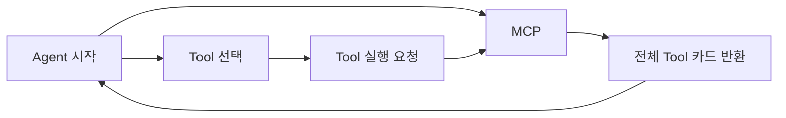
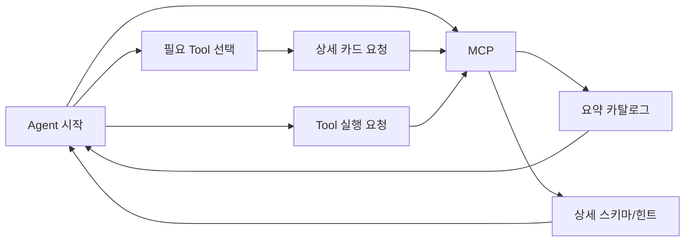
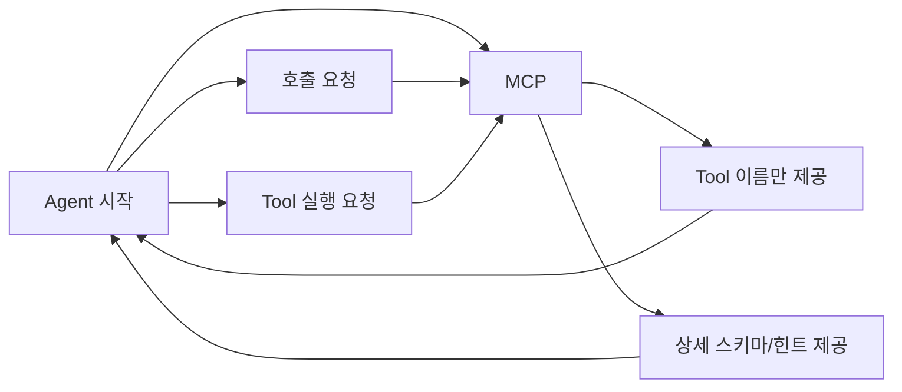

# 05. Agent에게 Tool 정보를 제공하는 전략

## 이 챕터에서 배우는 것

- 3가지 Tool 제공 전략을 **한 문서에서 비교**하기
- 서비스 상황에 맞는 전략을 **선택하는 기준** 만들기
- 전략별 흐름/장단점/운영 팁을 **실무 수준**으로 정리하기
- Agent 구현과 MCP 서버 구현의 **역할 분리** 이해하기

이 문서는 `01_엠씨피_개요`와 `02_엘엘엠_엠씨피_연동`에서 다룬 내용을 **고급 MCP 구현 전략**으로 확장합니다.  
이전 챕터에서 MCP가 Tool 목록을 제공하고 LLM이 이를 호출하는 구조를 이해했다면,  
이제는 **정보 제공 전략 자체를 설계**해야 합니다. 전략에 따라 토큰 비용, 보안 수준, 운영 난이도가 달라집니다.

---

## 1. 전략 개요

Tool 정보를 어떻게 제공하느냐에 따라 토큰 비용, 보안 수준, 구현 난이도가 달라집니다. 먼저 세 가지 전략을 큰 그림으로 이해한 뒤, 상황에 맞는 방식을 선택하는 것이 안전합니다.

이 전략은 `02_LLM_MCP_연동`의 “Tool 목록 로드 방식”을 **운영 정책 관점으로 확장**한 것입니다.  
즉, 단순 연결을 넘어 “언제 어떤 정보를 줄 것인가”를 설계하는 단계입니다.

이 문서는 **전략을 실제 구현으로 옮기는 방법**까지 다룹니다.  
따라서 각 전략별로 “MCP에서 무엇을 반환하고, Agent가 어떻게 요청하는지”를 코드로 확인합니다.

1) **전체 제공**: 모든 Tool 카드를 한 번에 전달
2) **부분 제공**: 요약 카탈로그 → 필요 시 상세 요청
3) **정보 후 제공**: 호출 시점에만 상세 제공

---

## 1-1. Agent 구현과 MCP 서버 구현을 함께 설계해야 하는 이유

MCP가 Agent와 연결된 상태에서는 “정보 제공 전략”이 **두 레이어에서 동시에 구현**됩니다.  
어느 한쪽만 구현하면 실제 품질이 나오지 않습니다.

**Agent 구현 측면**

- 어떤 정보를 **언제** 요청할지 결정한다(초기 전체 vs 필요 시 상세).
- MCP가 준 정보를 **프롬프트 컨텍스트로 가공**하고, 선택 실패 시 폴백 전략을 갖는다.
- Tool 결과를 바탕으로 **추가 정보 요청**(상세 카드/힌트)을 발행한다.

**MCP 서버 측면**

- 역할/권한에 따라 **도구 카드 노출 범위**를 제어한다.
- 도구 카드에 **힌트/예시/운영 정책**을 포함해 선택 품질을 높인다.
- 동적 힌트를 갱신하고 **버전 정책**을 운영한다.

즉, Agent는 “요청/사용 로직”, MCP는 “노출/정책 로직”을 담당합니다.

---

## 2. 선택 기준(실무 관점)

전략 선택은 “우리 서비스가 무엇을 더 중시하는가”에 따라 달라집니다. 아래 기준은 실무에서 가장 자주 사용하는 판단 기준입니다.

초급자는 “Tool 수/보안/비용” 기준만 익혀도 충분하고,  
중급 이상은 토큰 비용과 권한 제어의 균형을 세밀하게 조정해야 합니다.

- **Tool 수**: 많을수록 부분/정보 후 제공이 유리
- **보안 요구**: 민감할수록 정보 후 제공이 유리
- **토큰 비용**: 비용이 크면 부분/정보 후 제공이 유리
- **개발 속도**: 빠른 구현이면 전체 제공이 유리

---

## 3. 전략별 상세

### 3-1) 전략 1: 전체 제공

전체 제공은 가장 단순한 구조입니다. Tool 수가 적고 변동이 적을수록 효과적입니다.

이 전략은 개발 초기 단계에서 **빠르게 가치 검증**을 하고 싶을 때 유리합니다.

흐름



장점

- 구현이 단순하다.
- 디버깅이 쉽다.
- Tool 수가 적을 때 효율적이다.

단점

- Tool 수가 많아지면 토큰 비용이 커진다.
- 불필요한 정보까지 항상 전달된다.

적용 상황

- Tool 수가 10개 이하인 경우
- MVP 단계에서 빠른 구현이 필요한 경우

운영 팁

- Tool 카드 변경 시 **캐시 무효화**를 명확히 한다.
- 비용 증가가 예상되면 **부분 제공 전략**으로 전환 계획을 둔다.

Agent 구현 포인트

- 초기 프롬프트에 전체 카드를 주입하되, **토큰 한도**를 넘지 않도록 요약 규칙을 둔다.
- 자주 쓰는 Tool은 **세션 캐시**로 재사용해 비용을 줄인다.

MCP 서버 구현 포인트

- 전체 카드를 반환할 때 **권한에 따른 필드 마스킹**을 적용한다.
- 변경이 잦으면 **버전/etag**로 캐시 갱신을 제어한다.

구현 예시(개념)

```python
"""
목적: 전체 제공 전략의 MCP 응답 예시를 보여준다.
설명: Tool 카드 전체를 한 번에 반환한다.
디자인 패턴: Catalog Provider
"""

def list_all_tools(registry) -> list[dict]:
    return [card.__dict__ for card in registry.list_cards()]
```

---

### 3-2) 전략 2: 부분 제공

부분 제공은 “요약 → 상세”로 나누는 방식입니다. Tool 수가 많을 때 비용과 정확도의 균형을 맞출 수 있습니다.

이 전략은 **카탈로그 품질**이 선택 정확도를 좌우합니다.  
요약 카탈로그의 태그/설명이 부실하면 LLM이 잘못 선택할 가능성이 높습니다.

흐름



구현 포인트

- 요약 카탈로그에는 **이름/짧은 설명/태그**만 제공
- Agent가 필요하다고 판단하면 **상세 스키마를 요청**
- 상세 요청 실패 시 **대체 Tool 추천**을 반환

장점

- 토큰 비용 절감
- Tool 수가 많아도 관리 가능

단점

- 탐색 로직이 필요해 구현이 복잡해짐
- 잘못된 Tool 선택 가능성

운영 팁

- 태그/카테고리를 잘 설계하면 탐색 정확도가 올라간다.
- 잘못된 선택이 반복되면 **추천 규칙**을 개선한다.

Agent 구현 포인트

- 요약 카탈로그를 받은 뒤 **도메인 태그 기반 필터**로 후보를 좁힌다.
- 후보가 불명확하면 **상세 카드 요청**을 먼저 수행한다.

MCP 서버 구현 포인트

- 요약 카탈로그는 **짧고 안정적인 키**로 구성한다(이름/태그/요약).
- 상세 카드 요청 시 **권한별 필드 제한**을 적용한다.

구현 예시(개념)

```python
"""
목적: 부분 제공 전략의 MCP 응답 예시를 보여준다.
설명: 요약 카탈로그만 반환한다.
디자인 패턴: Summary Provider
"""

def list_summary_tools(registry) -> list[dict]:
    return [
        {"name": c.name, "description": c.description, "tags": ["billing", "erp"]}
        for c in registry.list_cards()
    ]


def get_tool_detail(registry, name: str) -> dict:
    return registry.get_card(name).__dict__
```

---

### 3-3) 전략 3: 정보 후 제공

정보 후 제공은 보안을 최우선으로 두는 방식입니다. 호출 직전에만 상세 정보를 주기 때문에 통제가 강합니다.

이 전략은 **권한 기반 분기**와 결합해야 효과가 큽니다.  
즉, 호출 시점에 정책 검증을 수행하고, 실패 시 대체 경로를 제공해야 합니다.

흐름



장점

- 불필요한 정보 노출 최소화
- 권한/정책 기반 제어에 유리
- Tool 추가가 쉬움

단점

- 설계 난이도가 높음
- 호출 직전에 실패 가능성 증가

적용 상황

- 보안/권한 이슈가 중요한 서비스
- Tool 수가 매우 많고 자주 변하는 환경

운영 팁

- 호출 직전 권한 체크 실패를 **명확한 에러 코드**로 반환한다.
- 실패 시 대체 Tool을 추천하거나 **요약 응답**으로 전환한다.

Agent 구현 포인트

- 호출 직전 **권한 사전 점검**을 수행하고, 실패 시 대체 경로로 라우팅한다.
- 최소 정보만 받은 상태에서 **추가 힌트 요청**을 단계적으로 수행한다.

MCP 서버 구현 포인트

- 호출 시점에만 상세 카드를 제공하고, **정책 실패 시 이유 코드**를 반환한다.
- 보안 요구가 높으면 **민감 필드 비노출**을 기본값으로 둔다.

구현 예시(개념)

```python
"""
목적: 정보 후 제공 전략의 MCP 응답 예시를 보여준다.
설명: 호출 직전에만 상세 카드를 제공한다.
디자인 패턴: Deferred Provider
"""

def get_tool_name_only(registry) -> list[str]:
    return [c.name for c in registry.list_cards()]


def get_tool_card_on_call(registry, name: str, role: str) -> dict:
    card = registry.get_card(name)
    if role != "admin" and card.name.startswith("admin_"):
        return {"error": "permission_denied"}
    return card.__dict__
```

---

## 4. 전략 전환 시 체크포인트

전략 전환은 단순한 설정 변경이 아니라 **에이전트 동작 방식**의 변경입니다. 전환 전후로 성능과 비용을 함께 점검해야 합니다.

전환 시 반드시 확인할 것:
- Tool 카드 캐시 무효화 정책
- 권한 정책의 일관성 유지
- 토큰 비용 변화 모니터링

- 기존 캐시/카탈로그 구조와 **호환되는지** 확인한다.
- 토큰 비용 변화와 **성능 영향**을 함께 측정한다.
- Agent의 Tool 선택 로직이 **전환 전략을 반영**하는지 점검한다.

---

## 5. 체크리스트

아래 항목은 전략을 실제 적용하기 전에 최소한 확인해야 하는 기준입니다.

- Tool 수와 토큰 비용이 산정되었는가?
- 보안/권한 요구사항이 정리되었는가?
- 선택한 전략의 이유가 문서화되었는가?
- 캐시/갱신 정책이 있는가?
- 전략 변경 시 전환 계획이 있는가?
